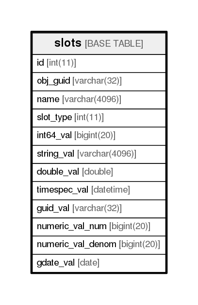

# slots

## Description

<details>
<summary><strong>Table Definition</strong></summary>

```sql
CREATE TABLE `slots` (
  `id` int(11) NOT NULL AUTO_INCREMENT,
  `obj_guid` varchar(32) NOT NULL,
  `name` varchar(4096) NOT NULL,
  `slot_type` int(11) NOT NULL,
  `int64_val` bigint(20) DEFAULT NULL,
  `string_val` varchar(4096) DEFAULT NULL,
  `double_val` double DEFAULT NULL,
  `timespec_val` datetime DEFAULT '1970-01-01 00:00:00',
  `guid_val` varchar(32) DEFAULT NULL,
  `numeric_val_num` bigint(20) DEFAULT NULL,
  `numeric_val_denom` bigint(20) DEFAULT NULL,
  `gdate_val` date DEFAULT NULL,
  PRIMARY KEY (`id`),
  KEY `slots_guid_index` (`obj_guid`)
) ENGINE=InnoDB AUTO_INCREMENT=9 DEFAULT CHARSET=utf8
```

</details>

## Columns

| Name              | Type          | Default             | Nullable | Children | Parents | Comment |
| ----------------- | ------------- | ------------------- | -------- | -------- | ------- | ------- |
| id                | int(11)       |                     | false    |          |         |         |
| obj_guid          | varchar(32)   |                     | false    |          |         |         |
| name              | varchar(4096) |                     | false    |          |         |         |
| slot_type         | int(11)       |                     | false    |          |         |         |
| int64_val         | bigint(20)    |                     | true     |          |         |         |
| string_val        | varchar(4096) |                     | true     |          |         |         |
| double_val        | double        |                     | true     |          |         |         |
| timespec_val      | datetime      | 1970-01-01 00:00:00 | true     |          |         |         |
| guid_val          | varchar(32)   |                     | true     |          |         |         |
| numeric_val_num   | bigint(20)    |                     | true     |          |         |         |
| numeric_val_denom | bigint(20)    |                     | true     |          |         |         |
| gdate_val         | date          |                     | true     |          |         |         |

## Constraints

| Name    | Type        | Definition       |
| ------- | ----------- | ---------------- |
| PRIMARY | PRIMARY KEY | PRIMARY KEY (id) |

## Indexes

| Name             | Definition                                  |
| ---------------- | ------------------------------------------- |
| slots_guid_index | KEY slots_guid_index (obj_guid) USING BTREE |
| PRIMARY          | PRIMARY KEY (id) USING BTREE                |

## Relations



---

> Generated by [tbls](https://github.com/k1LoW/tbls)
