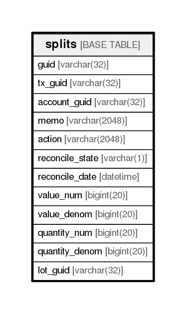

# splits

## Description

<details>
<summary><strong>Table Definition</strong></summary>

```sql
CREATE TABLE `splits` (
  `guid` varchar(32) NOT NULL,
  `tx_guid` varchar(32) NOT NULL,
  `account_guid` varchar(32) NOT NULL,
  `memo` varchar(2048) NOT NULL,
  `action` varchar(2048) NOT NULL,
  `reconcile_state` varchar(1) NOT NULL,
  `reconcile_date` datetime DEFAULT '1970-01-01 00:00:00',
  `value_num` bigint(20) NOT NULL,
  `value_denom` bigint(20) NOT NULL,
  `quantity_num` bigint(20) NOT NULL,
  `quantity_denom` bigint(20) NOT NULL,
  `lot_guid` varchar(32) DEFAULT NULL,
  PRIMARY KEY (`guid`),
  KEY `splits_tx_guid_index` (`tx_guid`),
  KEY `splits_account_guid_index` (`account_guid`)
) ENGINE=InnoDB DEFAULT CHARSET=utf8
```

</details>

## Columns

| Name            | Type          | Default             | Nullable | Children | Parents | Comment |
| --------------- | ------------- | ------------------- | -------- | -------- | ------- | ------- |
| guid            | varchar(32)   |                     | false    |          |         |         |
| tx_guid         | varchar(32)   |                     | false    |          |         |         |
| account_guid    | varchar(32)   |                     | false    |          |         |         |
| memo            | varchar(2048) |                     | false    |          |         |         |
| action          | varchar(2048) |                     | false    |          |         |         |
| reconcile_state | varchar(1)    |                     | false    |          |         |         |
| reconcile_date  | datetime      | 1970-01-01 00:00:00 | true     |          |         |         |
| value_num       | bigint(20)    |                     | false    |          |         |         |
| value_denom     | bigint(20)    |                     | false    |          |         |         |
| quantity_num    | bigint(20)    |                     | false    |          |         |         |
| quantity_denom  | bigint(20)    |                     | false    |          |         |         |
| lot_guid        | varchar(32)   |                     | true     |          |         |         |

## Constraints

| Name    | Type        | Definition         |
| ------- | ----------- | ------------------ |
| PRIMARY | PRIMARY KEY | PRIMARY KEY (guid) |

## Indexes

| Name                      | Definition                                               |
| ------------------------- | -------------------------------------------------------- |
| splits_account_guid_index | KEY splits_account_guid_index (account_guid) USING BTREE |
| splits_tx_guid_index      | KEY splits_tx_guid_index (tx_guid) USING BTREE           |
| PRIMARY                   | PRIMARY KEY (guid) USING BTREE                           |

## Relations



---

> Generated by [tbls](https://github.com/k1LoW/tbls)
