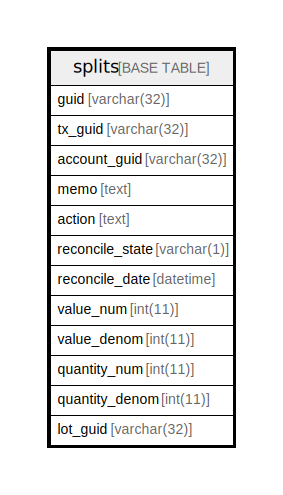

# splits

## 概要

<details>
<summary><strong>テーブル定義</strong></summary>

```sql
CREATE TABLE `splits` (
  `guid` varchar(32) NOT NULL,
  `tx_guid` varchar(32) NOT NULL,
  `account_guid` varchar(32) NOT NULL,
  `memo` text NOT NULL,
  `action` text NOT NULL,
  `reconcile_state` varchar(1) NOT NULL,
  `reconcile_date` datetime NOT NULL,
  `value_num` int(11) NOT NULL,
  `value_denom` int(11) NOT NULL,
  `quantity_num` int(11) NOT NULL,
  `quantity_denom` int(11) NOT NULL,
  `lot_guid` varchar(32) DEFAULT NULL,
  PRIMARY KEY (`guid`)
) ENGINE=InnoDB DEFAULT CHARSET=utf8mb4 COLLATE=utf8mb4_general_ci
```

</details>

## カラム一覧

| 名前              | タイプ         | デフォルト値       | NULL許可   | 子テーブル      | 親テーブル      | コメント     |
| --------------- | ----------- | ------------ | -------- | ---------- | ---------- | -------- |
| guid            | varchar(32) |              | false    |            |            |          |
| tx_guid         | varchar(32) |              | false    |            |            |          |
| account_guid    | varchar(32) |              | false    |            |            |          |
| memo            | text        |              | false    |            |            |          |
| action          | text        |              | false    |            |            |          |
| reconcile_state | varchar(1)  |              | false    |            |            |          |
| reconcile_date  | datetime    |              | false    |            |            |          |
| value_num       | int(11)     |              | false    |            |            |          |
| value_denom     | int(11)     |              | false    |            |            |          |
| quantity_num    | int(11)     |              | false    |            |            |          |
| quantity_denom  | int(11)     |              | false    |            |            |          |
| lot_guid        | varchar(32) | NULL         | true     |            |            |          |

## 制約一覧

| 名前      | タイプ         | 定義                 |
| ------- | ----------- | ------------------ |
| PRIMARY | PRIMARY KEY | PRIMARY KEY (guid) |

## INDEX一覧

| 名前      | 定義                             |
| ------- | ------------------------------ |
| PRIMARY | PRIMARY KEY (guid) USING BTREE |

## ER図



---

> Generated by [tbls](https://github.com/k1LoW/tbls)
