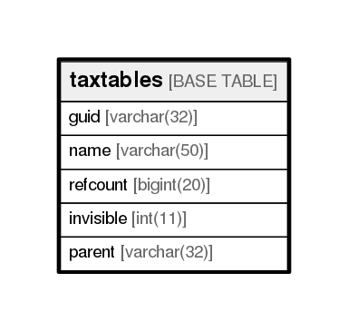

# taxtables

## Description

<details>
<summary><strong>Table Definition</strong></summary>

```sql
CREATE TABLE `taxtables` (
  `guid` varchar(32) NOT NULL,
  `name` varchar(50) NOT NULL,
  `refcount` bigint(20) NOT NULL,
  `invisible` int(11) NOT NULL,
  `parent` varchar(32) DEFAULT NULL,
  PRIMARY KEY (`guid`)
) ENGINE=InnoDB DEFAULT CHARSET=utf8
```

</details>

## Columns

| Name      | Type        | Default | Nullable | Children | Parents | Comment |
| --------- | ----------- | ------- | -------- | -------- | ------- | ------- |
| guid      | varchar(32) |         | false    |          |         |         |
| name      | varchar(50) |         | false    |          |         |         |
| refcount  | bigint(20)  |         | false    |          |         |         |
| invisible | int(11)     |         | false    |          |         |         |
| parent    | varchar(32) |         | true     |          |         |         |

## Constraints

| Name    | Type        | Definition         |
| ------- | ----------- | ------------------ |
| PRIMARY | PRIMARY KEY | PRIMARY KEY (guid) |

## Indexes

| Name    | Definition                     |
| ------- | ------------------------------ |
| PRIMARY | PRIMARY KEY (guid) USING BTREE |

## Relations



---

> Generated by [tbls](https://github.com/k1LoW/tbls)
