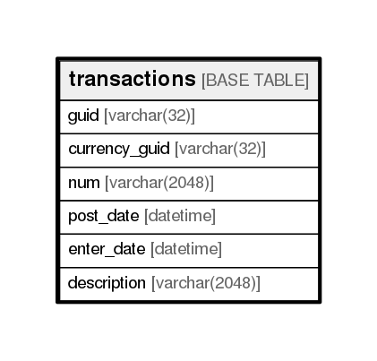

# transactions

## Description

<details>
<summary><strong>Table Definition</strong></summary>

```sql
CREATE TABLE `transactions` (
  `guid` varchar(32) NOT NULL,
  `currency_guid` varchar(32) NOT NULL,
  `num` varchar(2048) NOT NULL,
  `post_date` datetime DEFAULT '1970-01-01 00:00:00',
  `enter_date` datetime DEFAULT '1970-01-01 00:00:00',
  `description` varchar(2048) DEFAULT NULL,
  PRIMARY KEY (`guid`),
  KEY `tx_post_date_index` (`post_date`)
) ENGINE=InnoDB DEFAULT CHARSET=utf8
```

</details>

## Columns

| Name          | Type          | Default             | Nullable | Children | Parents | Comment |
| ------------- | ------------- | ------------------- | -------- | -------- | ------- | ------- |
| guid          | varchar(32)   |                     | false    |          |         |         |
| currency_guid | varchar(32)   |                     | false    |          |         |         |
| num           | varchar(2048) |                     | false    |          |         |         |
| post_date     | datetime      | 1970-01-01 00:00:00 | true     |          |         |         |
| enter_date    | datetime      | 1970-01-01 00:00:00 | true     |          |         |         |
| description   | varchar(2048) |                     | true     |          |         |         |

## Constraints

| Name    | Type        | Definition         |
| ------- | ----------- | ------------------ |
| PRIMARY | PRIMARY KEY | PRIMARY KEY (guid) |

## Indexes

| Name               | Definition                                     |
| ------------------ | ---------------------------------------------- |
| tx_post_date_index | KEY tx_post_date_index (post_date) USING BTREE |
| PRIMARY            | PRIMARY KEY (guid) USING BTREE                 |

## Relations



---

> Generated by [tbls](https://github.com/k1LoW/tbls)
