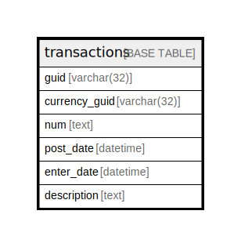

# transactions

## 概要

<details>
<summary><strong>テーブル定義</strong></summary>

```sql
CREATE TABLE `transactions` (
  `guid` text NOT NULL,
  `currency_guid` text NOT NULL,
  `num` text NOT NULL,
  `post_date` text DEFAULT NULL,
  `enter_date` text DEFAULT NULL,
  `description` text DEFAULT NULL,
  PRIMARY KEY (`guid`(255)),
  KEY `tx_post_date_index` (`post_date`(19))
) ENGINE=InnoDB DEFAULT CHARSET=utf8mb4 COLLATE=utf8mb4_general_ci
```

</details>

## カラム一覧

| 名前            | タイプ    | デフォルト値       | NULL許可   | 子テーブル      | 親テーブル      | コメント     |
| ------------- | ------ | ------------ | -------- | ---------- | ---------- | -------- |
| guid          | text   |              | false    |            |            |          |
| currency_guid | text   |              | false    |            |            |          |
| num           | text   |              | false    |            |            |          |
| post_date     | text   | NULL         | true     |            |            |          |
| enter_date    | text   | NULL         | true     |            |            |          |
| description   | text   | NULL         | true     |            |            |          |

## 制約一覧

| 名前      | タイプ         | 定義                 |
| ------- | ----------- | ------------------ |
| PRIMARY | PRIMARY KEY | PRIMARY KEY (guid) |

## INDEX一覧

| 名前                 | 定義                                             |
| ------------------ | ---------------------------------------------- |
| tx_post_date_index | KEY tx_post_date_index (post_date) USING BTREE |
| PRIMARY            | PRIMARY KEY (guid) USING BTREE                 |

## ER図



---

> Generated by [tbls](https://github.com/k1LoW/tbls)
