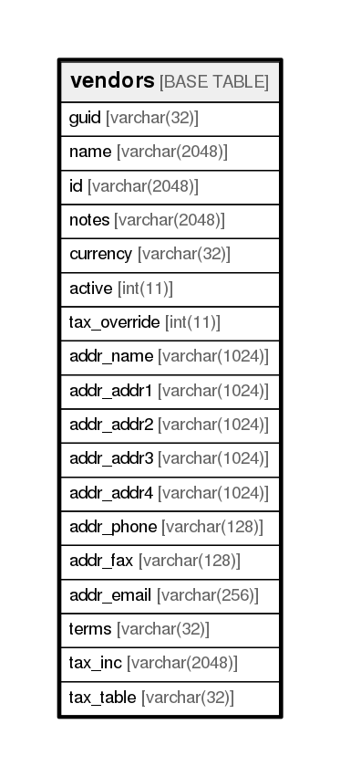

# vendors

## Description

<details>
<summary><strong>Table Definition</strong></summary>

```sql
CREATE TABLE `vendors` (
  `guid` varchar(32) NOT NULL,
  `name` varchar(2048) NOT NULL,
  `id` varchar(2048) NOT NULL,
  `notes` varchar(2048) NOT NULL,
  `currency` varchar(32) NOT NULL,
  `active` int(11) NOT NULL,
  `tax_override` int(11) NOT NULL,
  `addr_name` varchar(1024) DEFAULT NULL,
  `addr_addr1` varchar(1024) DEFAULT NULL,
  `addr_addr2` varchar(1024) DEFAULT NULL,
  `addr_addr3` varchar(1024) DEFAULT NULL,
  `addr_addr4` varchar(1024) DEFAULT NULL,
  `addr_phone` varchar(128) DEFAULT NULL,
  `addr_fax` varchar(128) DEFAULT NULL,
  `addr_email` varchar(256) DEFAULT NULL,
  `terms` varchar(32) DEFAULT NULL,
  `tax_inc` varchar(2048) DEFAULT NULL,
  `tax_table` varchar(32) DEFAULT NULL,
  PRIMARY KEY (`guid`)
) ENGINE=InnoDB DEFAULT CHARSET=utf8
```

</details>

## Columns

| Name         | Type          | Default | Nullable | Children | Parents | Comment |
| ------------ | ------------- | ------- | -------- | -------- | ------- | ------- |
| guid         | varchar(32)   |         | false    |          |         |         |
| name         | varchar(2048) |         | false    |          |         |         |
| id           | varchar(2048) |         | false    |          |         |         |
| notes        | varchar(2048) |         | false    |          |         |         |
| currency     | varchar(32)   |         | false    |          |         |         |
| active       | int(11)       |         | false    |          |         |         |
| tax_override | int(11)       |         | false    |          |         |         |
| addr_name    | varchar(1024) |         | true     |          |         |         |
| addr_addr1   | varchar(1024) |         | true     |          |         |         |
| addr_addr2   | varchar(1024) |         | true     |          |         |         |
| addr_addr3   | varchar(1024) |         | true     |          |         |         |
| addr_addr4   | varchar(1024) |         | true     |          |         |         |
| addr_phone   | varchar(128)  |         | true     |          |         |         |
| addr_fax     | varchar(128)  |         | true     |          |         |         |
| addr_email   | varchar(256)  |         | true     |          |         |         |
| terms        | varchar(32)   |         | true     |          |         |         |
| tax_inc      | varchar(2048) |         | true     |          |         |         |
| tax_table    | varchar(32)   |         | true     |          |         |         |

## Constraints

| Name    | Type        | Definition         |
| ------- | ----------- | ------------------ |
| PRIMARY | PRIMARY KEY | PRIMARY KEY (guid) |

## Indexes

| Name    | Definition                     |
| ------- | ------------------------------ |
| PRIMARY | PRIMARY KEY (guid) USING BTREE |

## Relations



---

> Generated by [tbls](https://github.com/k1LoW/tbls)
