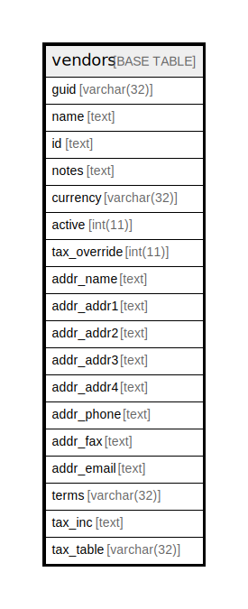

# vendors

## 概要

<details>
<summary><strong>テーブル定義</strong></summary>

```sql
CREATE TABLE `vendors` (
  `guid` varchar(32) NOT NULL,
  `name` text NOT NULL,
  `id` text NOT NULL,
  `notes` text NOT NULL,
  `currency` varchar(32) NOT NULL,
  `active` int(11) NOT NULL,
  `tax_override` int(11) NOT NULL,
  `addr_name` text DEFAULT NULL,
  `addr_addr1` text DEFAULT NULL,
  `addr_addr2` text DEFAULT NULL,
  `addr_addr3` text DEFAULT NULL,
  `addr_addr4` text DEFAULT NULL,
  `addr_phone` text DEFAULT NULL,
  `addr_fax` text DEFAULT NULL,
  `addr_email` text DEFAULT NULL,
  `terms` varchar(32) DEFAULT NULL,
  `tax_inc` text DEFAULT NULL,
  `tax_table` varchar(32) DEFAULT NULL,
  PRIMARY KEY (`guid`)
) ENGINE=InnoDB DEFAULT CHARSET=utf8mb4 COLLATE=utf8mb4_general_ci
```

</details>

## カラム一覧

| 名前           | タイプ         | デフォルト値       | NULL許可   | 子テーブル      | 親テーブル      | コメント     |
| ------------ | ----------- | ------------ | -------- | ---------- | ---------- | -------- |
| guid         | varchar(32) |              | false    |            |            |          |
| name         | text        |              | false    |            |            |          |
| id           | text        |              | false    |            |            |          |
| notes        | text        |              | false    |            |            |          |
| currency     | varchar(32) |              | false    |            |            |          |
| active       | int(11)     |              | false    |            |            |          |
| tax_override | int(11)     |              | false    |            |            |          |
| addr_name    | text        | NULL         | true     |            |            |          |
| addr_addr1   | text        | NULL         | true     |            |            |          |
| addr_addr2   | text        | NULL         | true     |            |            |          |
| addr_addr3   | text        | NULL         | true     |            |            |          |
| addr_addr4   | text        | NULL         | true     |            |            |          |
| addr_phone   | text        | NULL         | true     |            |            |          |
| addr_fax     | text        | NULL         | true     |            |            |          |
| addr_email   | text        | NULL         | true     |            |            |          |
| terms        | varchar(32) | NULL         | true     |            |            |          |
| tax_inc      | text        | NULL         | true     |            |            |          |
| tax_table    | varchar(32) | NULL         | true     |            |            |          |

## 制約一覧

| 名前      | タイプ         | 定義                 |
| ------- | ----------- | ------------------ |
| PRIMARY | PRIMARY KEY | PRIMARY KEY (guid) |

## INDEX一覧

| 名前      | 定義                             |
| ------- | ------------------------------ |
| PRIMARY | PRIMARY KEY (guid) USING BTREE |

## ER図



---

> Generated by [tbls](https://github.com/k1LoW/tbls)
