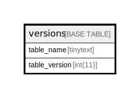

# versions

## 概要

<details>
<summary><strong>テーブル定義</strong></summary>

```sql
CREATE TABLE `versions` (
  `table_name` tinytext DEFAULT NULL,
  `table_version` int(11) DEFAULT NULL
) ENGINE=InnoDB DEFAULT CHARSET=utf8mb4 COLLATE=utf8mb4_general_ci
```

</details>

## カラム一覧

| 名前            | タイプ      | デフォルト値       | NULL許可   | 子テーブル      | 親テーブル      | コメント     |
| ------------- | -------- | ------------ | -------- | ---------- | ---------- | -------- |
| table_name    | tinytext | NULL         | true     |            |            |          |
| table_version | int(11)  | NULL         | true     |            |            |          |

## ER図



---

> Generated by [tbls](https://github.com/k1LoW/tbls)
