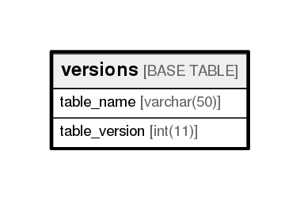

# versions

## Description

<details>
<summary><strong>Table Definition</strong></summary>

```sql
CREATE TABLE `versions` (
  `table_name` varchar(50) NOT NULL,
  `table_version` int(11) NOT NULL,
  PRIMARY KEY (`table_name`)
) ENGINE=InnoDB DEFAULT CHARSET=utf8
```

</details>

## Columns

| Name          | Type        | Default | Nullable | Children | Parents | Comment |
| ------------- | ----------- | ------- | -------- | -------- | ------- | ------- |
| table_name    | varchar(50) |         | false    |          |         |         |
| table_version | int(11)     |         | false    |          |         |         |

## Constraints

| Name    | Type        | Definition               |
| ------- | ----------- | ------------------------ |
| PRIMARY | PRIMARY KEY | PRIMARY KEY (table_name) |

## Indexes

| Name    | Definition                           |
| ------- | ------------------------------------ |
| PRIMARY | PRIMARY KEY (table_name) USING BTREE |

## Relations



---

> Generated by [tbls](https://github.com/k1LoW/tbls)
