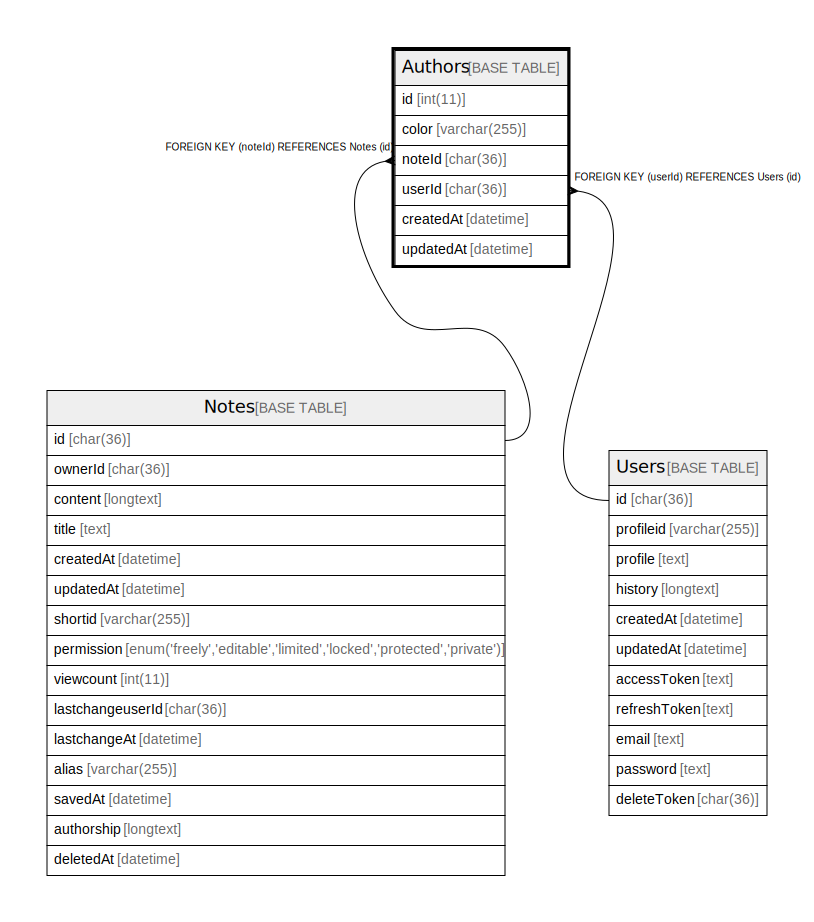

# Authors

## 概要

<details>
<summary><strong>テーブル定義</strong></summary>

```sql
CREATE TABLE `Authors` (
  `id` int(11) NOT NULL AUTO_INCREMENT,
  `color` varchar(255) DEFAULT NULL,
  `noteId` char(36) CHARACTER SET utf8mb4 COLLATE utf8mb4_bin DEFAULT NULL,
  `userId` char(36) CHARACTER SET utf8mb4 COLLATE utf8mb4_bin DEFAULT NULL,
  `createdAt` datetime DEFAULT NULL,
  `updatedAt` datetime DEFAULT NULL,
  PRIMARY KEY (`id`),
  KEY `Author_note_fkey` (`noteId`),
  KEY `Author_user_fkey` (`userId`),
  CONSTRAINT `Author_note_fkey` FOREIGN KEY (`noteId`) REFERENCES `Notes` (`id`) ON DELETE CASCADE,
  CONSTRAINT `Author_user_fkey` FOREIGN KEY (`userId`) REFERENCES `Users` (`id`) ON DELETE CASCADE
) ENGINE=InnoDB DEFAULT CHARSET=utf8mb4
```

</details>

## カラム一覧

| 名前        | タイプ          | デフォルト値       | NULL許可   | Extra Definition | 子テーブル      | 親テーブル             | コメント     |
| --------- | ------------ | ------------ | -------- | ---------------- | ---------- | ----------------- | -------- |
| id        | int(11)      |              | false    | auto_increment   |            |                   |          |
| color     | varchar(255) | NULL         | true     |                  |            |                   |          |
| noteId    | char(36)     | NULL         | true     |                  |            | [Notes](Notes.md) |          |
| userId    | char(36)     | NULL         | true     |                  |            | [Users](Users.md) |          |
| createdAt | datetime     | NULL         | true     |                  |            |                   |          |
| updatedAt | datetime     | NULL         | true     |                  |            |                   |          |

## 制約一覧

| 名前               | タイプ         | 定義                                         |
| ---------------- | ----------- | ------------------------------------------ |
| Author_note_fkey | FOREIGN KEY | FOREIGN KEY (noteId) REFERENCES Notes (id) |
| Author_user_fkey | FOREIGN KEY | FOREIGN KEY (userId) REFERENCES Users (id) |
| PRIMARY          | PRIMARY KEY | PRIMARY KEY (id)                           |

## INDEX一覧

| 名前               | 定義                                        |
| ---------------- | ----------------------------------------- |
| Author_note_fkey | KEY Author_note_fkey (noteId) USING BTREE |
| Author_user_fkey | KEY Author_user_fkey (userId) USING BTREE |
| PRIMARY          | PRIMARY KEY (id) USING BTREE              |

## ER図



---

> Generated by [tbls](https://github.com/k1LoW/tbls)
