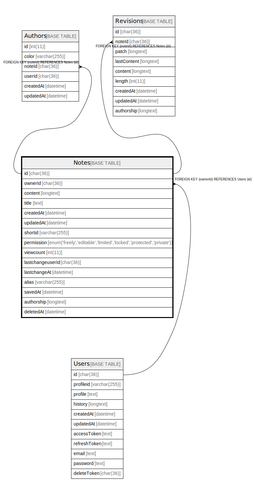

# Notes

## 概要

<details>
<summary><strong>テーブル定義</strong></summary>

```sql
CREATE TABLE `Notes` (
  `id` char(36) CHARACTER SET utf8mb4 COLLATE utf8mb4_bin NOT NULL,
  `ownerId` char(36) CHARACTER SET utf8mb4 COLLATE utf8mb4_bin DEFAULT NULL,
  `content` longtext DEFAULT NULL,
  `title` text DEFAULT NULL,
  `createdAt` datetime DEFAULT NULL,
  `updatedAt` datetime DEFAULT NULL,
  `shortid` varchar(255) NOT NULL DEFAULT '0000000000',
  `permission` enum('freely','editable','limited','locked','protected','private') DEFAULT NULL,
  `viewcount` int(11) DEFAULT 0,
  `lastchangeuserId` char(36) CHARACTER SET utf8mb4 COLLATE utf8mb4_bin DEFAULT NULL,
  `lastchangeAt` datetime DEFAULT NULL,
  `alias` varchar(255) DEFAULT NULL,
  `savedAt` datetime DEFAULT NULL,
  `authorship` longtext DEFAULT NULL,
  `deletedAt` datetime DEFAULT NULL,
  PRIMARY KEY (`id`),
  KEY `notes_shortid` (`shortid`),
  KEY `notes_alias` (`alias`),
  KEY `Notes_owner_fkey` (`ownerId`),
  CONSTRAINT `Notes_owner_fkey` FOREIGN KEY (`ownerId`) REFERENCES `Users` (`id`) ON DELETE CASCADE
) ENGINE=InnoDB DEFAULT CHARSET=utf8mb4
```

</details>

## カラム一覧

| 名前               | タイプ                                                                | デフォルト値       | NULL許可   | 子テーブル                                           | 親テーブル             | コメント     |
| ---------------- | ------------------------------------------------------------------ | ------------ | -------- | ----------------------------------------------- | ----------------- | -------- |
| id               | char(36)                                                           |              | false    | [Authors](Authors.md) [Revisions](Revisions.md) |                   |          |
| ownerId          | char(36)                                                           | NULL         | true     |                                                 | [Users](Users.md) |          |
| content          | longtext                                                           | NULL         | true     |                                                 |                   |          |
| title            | text                                                               | NULL         | true     |                                                 |                   |          |
| createdAt        | datetime                                                           | NULL         | true     |                                                 |                   |          |
| updatedAt        | datetime                                                           | NULL         | true     |                                                 |                   |          |
| shortid          | varchar(255)                                                       | '0000000000' | false    |                                                 |                   |          |
| permission       | enum('freely','editable','limited','locked','protected','private') | NULL         | true     |                                                 |                   |          |
| viewcount        | int(11)                                                            | 0            | true     |                                                 |                   |          |
| lastchangeuserId | char(36)                                                           | NULL         | true     |                                                 |                   |          |
| lastchangeAt     | datetime                                                           | NULL         | true     |                                                 |                   |          |
| alias            | varchar(255)                                                       | NULL         | true     |                                                 |                   |          |
| savedAt          | datetime                                                           | NULL         | true     |                                                 |                   |          |
| authorship       | longtext                                                           | NULL         | true     |                                                 |                   |          |
| deletedAt        | datetime                                                           | NULL         | true     |                                                 |                   |          |

## 制約一覧

| 名前               | タイプ         | 定義                                          |
| ---------------- | ----------- | ------------------------------------------- |
| Notes_owner_fkey | FOREIGN KEY | FOREIGN KEY (ownerId) REFERENCES Users (id) |
| PRIMARY          | PRIMARY KEY | PRIMARY KEY (id)                            |

## INDEX一覧

| 名前               | 定義                                         |
| ---------------- | ------------------------------------------ |
| notes_alias      | KEY notes_alias (alias) USING BTREE        |
| Notes_owner_fkey | KEY Notes_owner_fkey (ownerId) USING BTREE |
| notes_shortid    | KEY notes_shortid (shortid) USING BTREE    |
| PRIMARY          | PRIMARY KEY (id) USING BTREE               |

## ER図



---

> Generated by [tbls](https://github.com/k1LoW/tbls)
