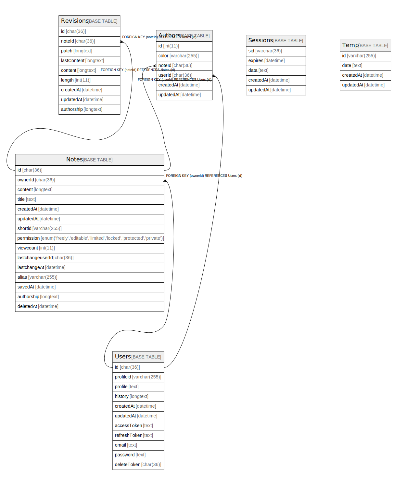

# Database Schema

## テーブル一覧

| 名前                        | カラム一覧      | コメント     | タイプ        |
| ------------------------- | ---------- | -------- | ---------- |
| [Authors](Authors.md)     | 6          |          | BASE TABLE |
| [Notes](Notes.md)         | 15         |          | BASE TABLE |
| [Revisions](Revisions.md) | 9          |          | BASE TABLE |
| [Sessions](Sessions.md)   | 5          |          | BASE TABLE |
| [Temp](Temp.md)           | 4          |          | BASE TABLE |
| [Users](Users.md)         | 11         |          | BASE TABLE |

## ER図

---

> Generated by [tbls](https://github.com/k1LoW/tbls)
