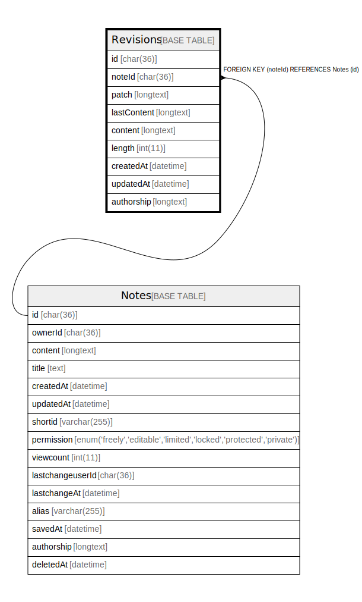

# Revisions

## 概要

<details>
<summary><strong>テーブル定義</strong></summary>

```sql
CREATE TABLE `Revisions` (
  `id` char(36) CHARACTER SET utf8mb4 COLLATE utf8mb4_bin NOT NULL,
  `noteId` char(36) CHARACTER SET utf8mb4 COLLATE utf8mb4_bin DEFAULT NULL,
  `patch` longtext DEFAULT NULL,
  `lastContent` longtext DEFAULT NULL,
  `content` longtext DEFAULT NULL,
  `length` int(11) DEFAULT NULL,
  `createdAt` datetime DEFAULT NULL,
  `updatedAt` datetime DEFAULT NULL,
  `authorship` longtext DEFAULT NULL,
  PRIMARY KEY (`id`),
  KEY `Revisions_note_fkey` (`noteId`),
  CONSTRAINT `Revisions_note_fkey` FOREIGN KEY (`noteId`) REFERENCES `Notes` (`id`) ON DELETE CASCADE
) ENGINE=InnoDB DEFAULT CHARSET=utf8mb4
```

</details>

## カラム一覧

| 名前          | タイプ      | デフォルト値       | NULL許可   | 子テーブル      | 親テーブル             | コメント     |
| ----------- | -------- | ------------ | -------- | ---------- | ----------------- | -------- |
| id          | char(36) |              | false    |            |                   |          |
| noteId      | char(36) | NULL         | true     |            | [Notes](Notes.md) |          |
| patch       | longtext | NULL         | true     |            |                   |          |
| lastContent | longtext | NULL         | true     |            |                   |          |
| content     | longtext | NULL         | true     |            |                   |          |
| length      | int(11)  | NULL         | true     |            |                   |          |
| createdAt   | datetime | NULL         | true     |            |                   |          |
| updatedAt   | datetime | NULL         | true     |            |                   |          |
| authorship  | longtext | NULL         | true     |            |                   |          |

## 制約一覧

| 名前                  | タイプ         | 定義                                         |
| ------------------- | ----------- | ------------------------------------------ |
| PRIMARY             | PRIMARY KEY | PRIMARY KEY (id)                           |
| Revisions_note_fkey | FOREIGN KEY | FOREIGN KEY (noteId) REFERENCES Notes (id) |

## INDEX一覧

| 名前                  | 定義                                           |
| ------------------- | -------------------------------------------- |
| Revisions_note_fkey | KEY Revisions_note_fkey (noteId) USING BTREE |
| PRIMARY             | PRIMARY KEY (id) USING BTREE                 |

## ER図



---

> Generated by [tbls](https://github.com/k1LoW/tbls)
