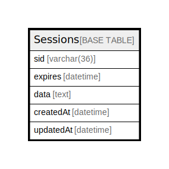

# Sessions

## 概要

<details>
<summary><strong>テーブル定義</strong></summary>

```sql
CREATE TABLE `Sessions` (
  `sid` varchar(36) NOT NULL,
  `expires` datetime DEFAULT NULL,
  `data` text DEFAULT NULL,
  `createdAt` datetime NOT NULL,
  `updatedAt` datetime NOT NULL,
  PRIMARY KEY (`sid`)
) ENGINE=InnoDB DEFAULT CHARSET=utf8mb4
```

</details>

## カラム一覧

| 名前        | タイプ         | デフォルト値       | NULL許可   | 子テーブル      | 親テーブル      | コメント     |
| --------- | ----------- | ------------ | -------- | ---------- | ---------- | -------- |
| sid       | varchar(36) |              | false    |            |            |          |
| expires   | datetime    | NULL         | true     |            |            |          |
| data      | text        | NULL         | true     |            |            |          |
| createdAt | datetime    |              | false    |            |            |          |
| updatedAt | datetime    |              | false    |            |            |          |

## 制約一覧

| 名前      | タイプ         | 定義                |
| ------- | ----------- | ----------------- |
| PRIMARY | PRIMARY KEY | PRIMARY KEY (sid) |

## INDEX一覧

| 名前      | 定義                            |
| ------- | ----------------------------- |
| PRIMARY | PRIMARY KEY (sid) USING BTREE |

## ER図



---

> Generated by [tbls](https://github.com/k1LoW/tbls)
