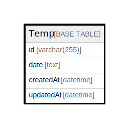

# Temp

## 概要

<details>
<summary><strong>テーブル定義</strong></summary>

```sql
CREATE TABLE `Temp` (
  `id` varchar(255) NOT NULL,
  `date` text DEFAULT NULL,
  `createdAt` datetime DEFAULT NULL,
  `updatedAt` datetime DEFAULT NULL,
  PRIMARY KEY (`id`)
) ENGINE=InnoDB DEFAULT CHARSET=utf8mb4
```

</details>

## カラム一覧

| 名前        | タイプ          | デフォルト値       | NULL許可   | 子テーブル      | 親テーブル      | コメント     |
| --------- | ------------ | ------------ | -------- | ---------- | ---------- | -------- |
| id        | varchar(255) |              | false    |            |            |          |
| date      | text         | NULL         | true     |            |            |          |
| createdAt | datetime     | NULL         | true     |            |            |          |
| updatedAt | datetime     | NULL         | true     |            |            |          |

## 制約一覧

| 名前      | タイプ         | 定義               |
| ------- | ----------- | ---------------- |
| PRIMARY | PRIMARY KEY | PRIMARY KEY (id) |

## INDEX一覧

| 名前      | 定義                           |
| ------- | ---------------------------- |
| PRIMARY | PRIMARY KEY (id) USING BTREE |

## ER図



---

> Generated by [tbls](https://github.com/k1LoW/tbls)
