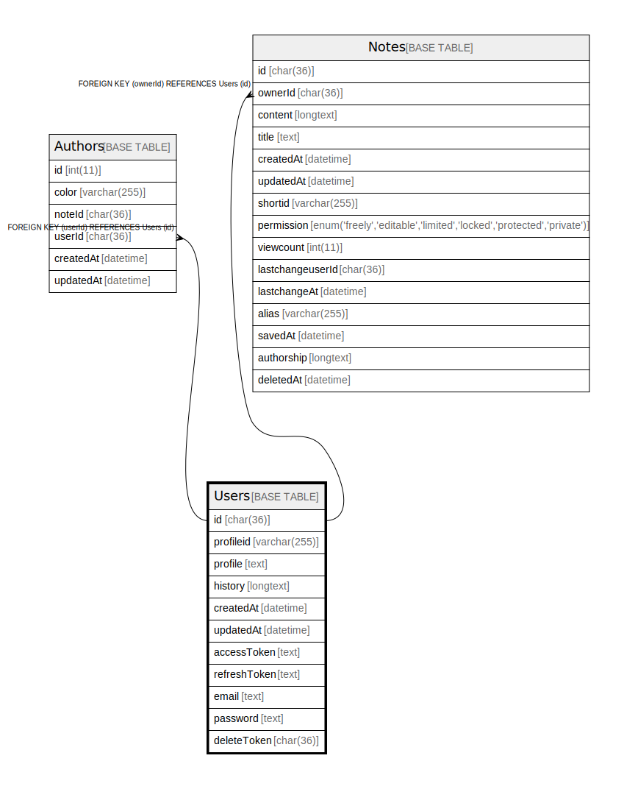

# Users

## 概要

<details>
<summary><strong>テーブル定義</strong></summary>

```sql
CREATE TABLE `Users` (
  `id` char(36) CHARACTER SET utf8mb4 COLLATE utf8mb4_bin NOT NULL,
  `profileid` varchar(255) DEFAULT NULL,
  `profile` text DEFAULT NULL,
  `history` longtext DEFAULT NULL,
  `createdAt` datetime DEFAULT NULL,
  `updatedAt` datetime DEFAULT NULL,
  `accessToken` text DEFAULT NULL,
  `refreshToken` text DEFAULT NULL,
  `email` text DEFAULT NULL,
  `password` text DEFAULT NULL,
  `deleteToken` char(36) CHARACTER SET utf8mb4 COLLATE utf8mb4_bin DEFAULT NULL,
  PRIMARY KEY (`id`),
  UNIQUE KEY `profileid` (`profileid`)
) ENGINE=InnoDB DEFAULT CHARSET=utf8mb4
```

</details>

## カラム一覧

| 名前           | タイプ          | デフォルト値       | NULL許可   | 子テーブル                                   | 親テーブル      | コメント     |
| ------------ | ------------ | ------------ | -------- | --------------------------------------- | ---------- | -------- |
| id           | char(36)     |              | false    | [Authors](Authors.md) [Notes](Notes.md) |            |          |
| profileid    | varchar(255) | NULL         | true     |                                         |            |          |
| profile      | text         | NULL         | true     |                                         |            |          |
| history      | longtext     | NULL         | true     |                                         |            |          |
| createdAt    | datetime     | NULL         | true     |                                         |            |          |
| updatedAt    | datetime     | NULL         | true     |                                         |            |          |
| accessToken  | text         | NULL         | true     |                                         |            |          |
| refreshToken | text         | NULL         | true     |                                         |            |          |
| email        | text         | NULL         | true     |                                         |            |          |
| password     | text         | NULL         | true     |                                         |            |          |
| deleteToken  | char(36)     | NULL         | true     |                                         |            |          |

## 制約一覧

| 名前        | タイプ         | 定義                               |
| --------- | ----------- | -------------------------------- |
| PRIMARY   | PRIMARY KEY | PRIMARY KEY (id)                 |
| profileid | UNIQUE      | UNIQUE KEY profileid (profileid) |

## INDEX一覧

| 名前        | 定義                                           |
| --------- | -------------------------------------------- |
| PRIMARY   | PRIMARY KEY (id) USING BTREE                 |
| profileid | UNIQUE KEY profileid (profileid) USING BTREE |

## ER図



---

> Generated by [tbls](https://github.com/k1LoW/tbls)
