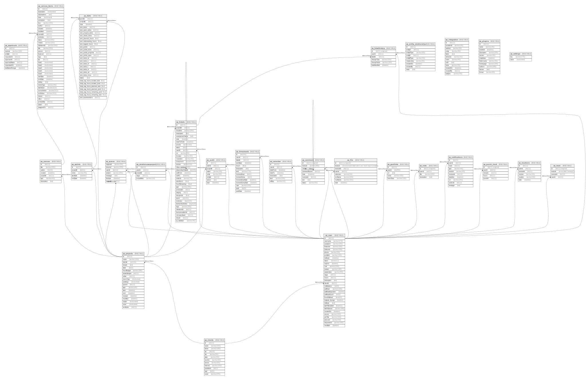

# Leantime

## 概要

version 3(WIP)

## テーブル一覧

| 名前                                                  | カラム一覧      | コメント     | タイプ        |
| --------------------------------------------------- | ---------- | -------- | ---------- |
| [zp_approvals](zp_approvals.md)                     | 8          |          | BASE TABLE |
| [zp_audit](zp_audit.md)                             | 8          |          | BASE TABLE |
| [zp_calendar](zp_calendar.md)                       | 7          |          | BASE TABLE |
| [zp_canvas](zp_canvas.md)                           | 7          |          | BASE TABLE |
| [zp_canvas_items](zp_canvas_items.md)               | 36         |          | BASE TABLE |
| [zp_clients](zp_clients.md)                         | 12         |          | BASE TABLE |
| [zp_comment](zp_comment.md)                         | 8          |          | BASE TABLE |
| [zp_entity_relationship](zp_entity_relationship.md) | 9          |          | BASE TABLE |
| [zp_file](zp_file.md)                               | 8          |          | BASE TABLE |
| [zp_gcallinks](zp_gcallinks.md)                     | 5          |          | BASE TABLE |
| [zp_integration](zp_integration.md)                 | 12         |          | BASE TABLE |
| [zp_note](zp_note.md)                               | 4          |          | BASE TABLE |
| [zp_notifications](zp_notifications.md)             | 10         |          | BASE TABLE |
| [zp_plugins](zp_plugins.md)                         | 11         |          | BASE TABLE |
| [zp_projects](zp_projects.md)                       | 19         |          | BASE TABLE |
| [zp_punch_clock](zp_punch_clock.md)                 | 5          |          | BASE TABLE |
| [zp_queue](zp_queue.md)                             | 7          |          | BASE TABLE |
| [zp_reactions](zp_reactions.md)                     | 6          |          | BASE TABLE |
| [zp_read](zp_read.md)                               | 4          |          | BASE TABLE |
| [zp_relationuserproject](zp_relationuserproject.md) | 5          |          | BASE TABLE |
| [zp_settings](zp_settings.md)                       | 2          |          | BASE TABLE |
| [zp_sprints](zp_sprints.md)                         | 5          |          | BASE TABLE |
| [zp_stats](zp_stats.md)                             | 29         |          | BASE TABLE |
| [zp_tickethistory](zp_tickethistory.md)             | 6          |          | BASE TABLE |
| [zp_tickets](zp_tickets.md)                         | 35         |          | BASE TABLE |
| [zp_timesheets](zp_timesheets.md)                   | 14         |          | BASE TABLE |
| [zp_user](zp_user.md)                               | 32         |          | BASE TABLE |

## ER図

---

> Generated by [tbls](https://github.com/k1LoW/tbls)
