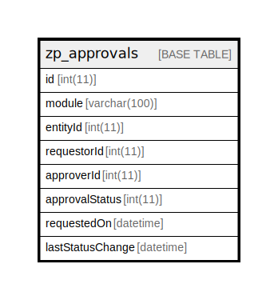

# zp_approvals

## 概要

<details>
<summary><strong>テーブル定義</strong></summary>

```sql
CREATE TABLE `zp_approvals` (
  `id` int(11) NOT NULL AUTO_INCREMENT,
  `module` varchar(100) DEFAULT NULL,
  `entityId` int(11) DEFAULT NULL,
  `requestorId` int(11) DEFAULT NULL,
  `approverId` int(11) DEFAULT NULL,
  `approvalStatus` int(11) DEFAULT NULL,
  `requestedOn` datetime DEFAULT NULL,
  `lastStatusChange` datetime DEFAULT NULL,
  PRIMARY KEY (`id`)
) ENGINE=InnoDB DEFAULT CHARSET=utf8mb4 COLLATE=utf8mb4_unicode_ci
```

</details>

## カラム一覧

| 名前               | タイプ          | デフォルト値       | Nullable | Extra Definition | 子テーブル      | 親テーブル      | コメント     |
| ---------------- | ------------ | ------------ | -------- | ---------------- | ---------- | ---------- | -------- |
| id               | int(11)      |              | false    | auto_increment   |            |            |          |
| module           | varchar(100) | NULL         | true     |                  |            |            |          |
| entityId         | int(11)      | NULL         | true     |                  |            |            |          |
| requestorId      | int(11)      | NULL         | true     |                  |            |            |          |
| approverId       | int(11)      | NULL         | true     |                  |            |            |          |
| approvalStatus   | int(11)      | NULL         | true     |                  |            |            |          |
| requestedOn      | datetime     | NULL         | true     |                  |            |            |          |
| lastStatusChange | datetime     | NULL         | true     |                  |            |            |          |

## 制約一覧

| 名前      | タイプ         | 定義               |
| ------- | ----------- | ---------------- |
| PRIMARY | PRIMARY KEY | PRIMARY KEY (id) |

## INDEX一覧

| 名前      | 定義                           |
| ------- | ---------------------------- |
| PRIMARY | PRIMARY KEY (id) USING BTREE |

## ER図



---

> Generated by [tbls](https://github.com/k1LoW/tbls)
