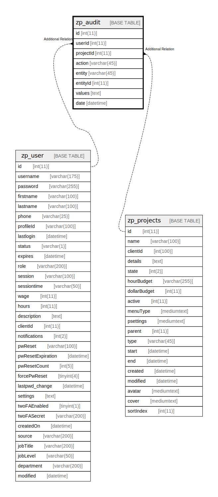

# zp_audit

## 概要

<details>
<summary><strong>テーブル定義</strong></summary>

```sql
CREATE TABLE `zp_audit` (
  `id` int(11) NOT NULL AUTO_INCREMENT,
  `userId` int(11) DEFAULT NULL,
  `projectId` int(11) DEFAULT NULL,
  `action` varchar(45) DEFAULT NULL,
  `entity` varchar(45) DEFAULT NULL,
  `entityId` int(11) DEFAULT NULL,
  `values` text DEFAULT NULL,
  `date` datetime DEFAULT NULL,
  PRIMARY KEY (`id`),
  KEY `projectId` (`projectId`),
  KEY `projectAction` (`projectId`,`action`),
  KEY `projectEntityEntityId` (`projectId`,`entity`,`entityId`)
) ENGINE=InnoDB DEFAULT CHARSET=utf8mb4 COLLATE=utf8mb4_unicode_ci
```

</details>

## カラム一覧

| 名前        | タイプ         | デフォルト値       | Nullable | Extra Definition | 子テーブル      | 親テーブル                         | コメント     |
| --------- | ----------- | ------------ | -------- | ---------------- | ---------- | ----------------------------- | -------- |
| id        | int(11)     |              | false    | auto_increment   |            |                               |          |
| userId    | int(11)     | NULL         | true     |                  |            | [zp_user](zp_user.md)         |          |
| projectId | int(11)     | NULL         | true     |                  |            | [zp_projects](zp_projects.md) |          |
| action    | varchar(45) | NULL         | true     |                  |            |                               |          |
| entity    | varchar(45) | NULL         | true     |                  |            |                               |          |
| entityId  | int(11)     | NULL         | true     |                  |            |                               |          |
| values    | text        | NULL         | true     |                  |            |                               |          |
| date      | datetime    | NULL         | true     |                  |            |                               |          |

## 制約一覧

| 名前      | タイプ         | 定義               |
| ------- | ----------- | ---------------- |
| PRIMARY | PRIMARY KEY | PRIMARY KEY (id) |

## INDEX一覧

| 名前                    | 定義                                                                  |
| --------------------- | ------------------------------------------------------------------- |
| projectAction         | KEY projectAction (projectId, action) USING BTREE                   |
| projectEntityEntityId | KEY projectEntityEntityId (projectId, entity, entityId) USING BTREE |
| projectId             | KEY projectId (projectId) USING BTREE                               |
| PRIMARY               | PRIMARY KEY (id) USING BTREE                                        |

## ER図



---

> Generated by [tbls](https://github.com/k1LoW/tbls)
