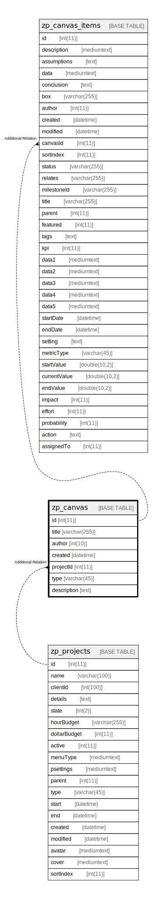

# zp_canvas

## 概要

<details>
<summary><strong>テーブル定義</strong></summary>

```sql
CREATE TABLE `zp_canvas` (
  `id` int(11) NOT NULL AUTO_INCREMENT,
  `title` varchar(255) DEFAULT NULL,
  `author` int(10) DEFAULT NULL,
  `created` datetime DEFAULT NULL,
  `projectId` int(11) DEFAULT NULL,
  `type` varchar(45) DEFAULT NULL,
  `description` text DEFAULT NULL,
  PRIMARY KEY (`id`),
  KEY `ProjectIdType` (`projectId`,`type`)
) ENGINE=InnoDB AUTO_INCREMENT=[Redacted by tbls] DEFAULT CHARSET=utf8mb4 COLLATE=utf8mb4_unicode_ci
```

</details>

## カラム一覧

| 名前          | タイプ          | デフォルト値       | Nullable | Extra Definition | 子テーブル                                 | 親テーブル                         | コメント     |
| ----------- | ------------ | ------------ | -------- | ---------------- | ------------------------------------- | ----------------------------- | -------- |
| id          | int(11)      |              | false    | auto_increment   | [zp_canvas_items](zp_canvas_items.md) |                               |          |
| title       | varchar(255) | NULL         | true     |                  |                                       |                               |          |
| author      | int(10)      | NULL         | true     |                  |                                       |                               |          |
| created     | datetime     | NULL         | true     |                  |                                       |                               |          |
| projectId   | int(11)      | NULL         | true     |                  |                                       | [zp_projects](zp_projects.md) |          |
| type        | varchar(45)  | NULL         | true     |                  |                                       |                               |          |
| description | text         | NULL         | true     |                  |                                       |                               |          |

## 制約一覧

| 名前      | タイプ         | 定義               |
| ------- | ----------- | ---------------- |
| PRIMARY | PRIMARY KEY | PRIMARY KEY (id) |

## INDEX一覧

| 名前            | 定義                                              |
| ------------- | ----------------------------------------------- |
| ProjectIdType | KEY ProjectIdType (projectId, type) USING BTREE |
| PRIMARY       | PRIMARY KEY (id) USING BTREE                    |

## ER図



---

> Generated by [tbls](https://github.com/k1LoW/tbls)
