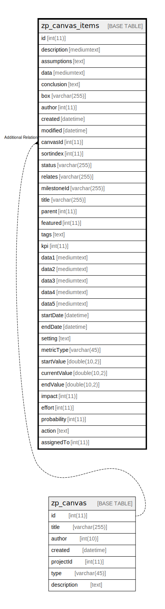

# zp_canvas_items

## 概要

<details>
<summary><strong>テーブル定義</strong></summary>

```sql
CREATE TABLE `zp_canvas_items` (
  `id` int(11) NOT NULL AUTO_INCREMENT,
  `description` mediumtext DEFAULT NULL,
  `assumptions` text DEFAULT NULL,
  `data` mediumtext DEFAULT NULL,
  `conclusion` text DEFAULT NULL,
  `box` varchar(255) DEFAULT NULL,
  `author` int(11) DEFAULT NULL,
  `created` datetime DEFAULT NULL,
  `modified` datetime DEFAULT NULL,
  `canvasId` int(11) DEFAULT NULL,
  `sortindex` int(11) DEFAULT NULL,
  `status` varchar(255) DEFAULT NULL,
  `relates` varchar(255) DEFAULT NULL,
  `milestoneId` varchar(255) DEFAULT NULL,
  `title` varchar(255) DEFAULT NULL,
  `parent` int(11) DEFAULT NULL,
  `featured` int(11) DEFAULT NULL,
  `tags` text DEFAULT NULL,
  `kpi` int(11) DEFAULT NULL,
  `data1` mediumtext DEFAULT NULL,
  `data2` mediumtext DEFAULT NULL,
  `data3` mediumtext DEFAULT NULL,
  `data4` mediumtext DEFAULT NULL,
  `data5` mediumtext DEFAULT NULL,
  `startDate` datetime DEFAULT NULL,
  `endDate` datetime DEFAULT NULL,
  `setting` text DEFAULT NULL,
  `metricType` varchar(45) DEFAULT NULL,
  `startValue` double(10,2) DEFAULT NULL,
  `currentValue` double(10,2) DEFAULT NULL,
  `endValue` double(10,2) DEFAULT NULL,
  `impact` int(11) DEFAULT NULL,
  `effort` int(11) DEFAULT NULL,
  `probability` int(11) DEFAULT NULL,
  `action` text DEFAULT NULL,
  `assignedTo` int(11) DEFAULT NULL,
  PRIMARY KEY (`id`),
  KEY `CanvasLookUp` (`canvasId`,`box`)
) ENGINE=InnoDB DEFAULT CHARSET=utf8mb4 COLLATE=utf8mb4_unicode_ci
```

</details>

## カラム一覧

| 名前           | タイプ          | デフォルト値       | Nullable | Extra Definition | 子テーブル      | 親テーブル                     | コメント     |
| ------------ | ------------ | ------------ | -------- | ---------------- | ---------- | ------------------------- | -------- |
| id           | int(11)      |              | false    | auto_increment   |            |                           |          |
| description  | mediumtext   | NULL         | true     |                  |            |                           |          |
| assumptions  | text         | NULL         | true     |                  |            |                           |          |
| data         | mediumtext   | NULL         | true     |                  |            |                           |          |
| conclusion   | text         | NULL         | true     |                  |            |                           |          |
| box          | varchar(255) | NULL         | true     |                  |            |                           |          |
| author       | int(11)      | NULL         | true     |                  |            |                           |          |
| created      | datetime     | NULL         | true     |                  |            |                           |          |
| modified     | datetime     | NULL         | true     |                  |            |                           |          |
| canvasId     | int(11)      | NULL         | true     |                  |            | [zp_canvas](zp_canvas.md) |          |
| sortindex    | int(11)      | NULL         | true     |                  |            |                           |          |
| status       | varchar(255) | NULL         | true     |                  |            |                           |          |
| relates      | varchar(255) | NULL         | true     |                  |            |                           |          |
| milestoneId  | varchar(255) | NULL         | true     |                  |            |                           |          |
| title        | varchar(255) | NULL         | true     |                  |            |                           |          |
| parent       | int(11)      | NULL         | true     |                  |            |                           |          |
| featured     | int(11)      | NULL         | true     |                  |            |                           |          |
| tags         | text         | NULL         | true     |                  |            |                           |          |
| kpi          | int(11)      | NULL         | true     |                  |            |                           |          |
| data1        | mediumtext   | NULL         | true     |                  |            |                           |          |
| data2        | mediumtext   | NULL         | true     |                  |            |                           |          |
| data3        | mediumtext   | NULL         | true     |                  |            |                           |          |
| data4        | mediumtext   | NULL         | true     |                  |            |                           |          |
| data5        | mediumtext   | NULL         | true     |                  |            |                           |          |
| startDate    | datetime     | NULL         | true     |                  |            |                           |          |
| endDate      | datetime     | NULL         | true     |                  |            |                           |          |
| setting      | text         | NULL         | true     |                  |            |                           |          |
| metricType   | varchar(45)  | NULL         | true     |                  |            |                           |          |
| startValue   | double(10,2) | NULL         | true     |                  |            |                           |          |
| currentValue | double(10,2) | NULL         | true     |                  |            |                           |          |
| endValue     | double(10,2) | NULL         | true     |                  |            |                           |          |
| impact       | int(11)      | NULL         | true     |                  |            |                           |          |
| effort       | int(11)      | NULL         | true     |                  |            |                           |          |
| probability  | int(11)      | NULL         | true     |                  |            |                           |          |
| action       | text         | NULL         | true     |                  |            |                           |          |
| assignedTo   | int(11)      | NULL         | true     |                  |            |                           |          |

## 制約一覧

| 名前      | タイプ         | 定義               |
| ------- | ----------- | ---------------- |
| PRIMARY | PRIMARY KEY | PRIMARY KEY (id) |

## INDEX一覧

| 名前           | 定義                                           |
| ------------ | -------------------------------------------- |
| CanvasLookUp | KEY CanvasLookUp (canvasId, box) USING BTREE |
| PRIMARY      | PRIMARY KEY (id) USING BTREE                 |

## ER図



---

> Generated by [tbls](https://github.com/k1LoW/tbls)
