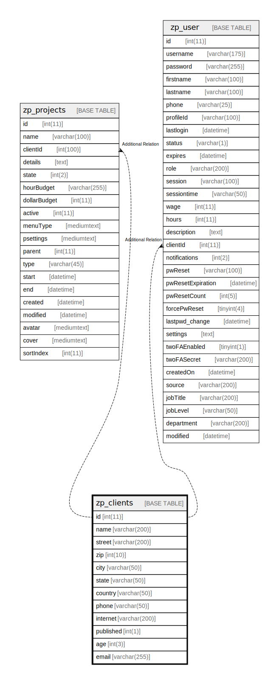

# zp_clients

## 概要

<details>
<summary><strong>テーブル定義</strong></summary>

```sql
CREATE TABLE `zp_clients` (
  `id` int(11) NOT NULL AUTO_INCREMENT,
  `name` varchar(200) DEFAULT NULL,
  `street` varchar(200) DEFAULT NULL,
  `zip` int(10) DEFAULT NULL,
  `city` varchar(50) DEFAULT NULL,
  `state` varchar(50) DEFAULT NULL,
  `country` varchar(50) DEFAULT NULL,
  `phone` varchar(50) DEFAULT NULL,
  `internet` varchar(200) DEFAULT NULL,
  `published` int(1) DEFAULT NULL,
  `age` int(3) DEFAULT NULL,
  `email` varchar(255) DEFAULT NULL,
  PRIMARY KEY (`id`)
) ENGINE=InnoDB AUTO_INCREMENT=[Redacted by tbls] DEFAULT CHARSET=utf8mb4 COLLATE=utf8mb4_unicode_ci
```

</details>

## カラム一覧

| 名前        | タイプ          | デフォルト値       | Nullable | Extra Definition | 子テーブル                                               | 親テーブル      | コメント     |
| --------- | ------------ | ------------ | -------- | ---------------- | --------------------------------------------------- | ---------- | -------- |
| id        | int(11)      |              | false    | auto_increment   | [zp_projects](zp_projects.md) [zp_user](zp_user.md) |            |          |
| name      | varchar(200) | NULL         | true     |                  |                                                     |            |          |
| street    | varchar(200) | NULL         | true     |                  |                                                     |            |          |
| zip       | int(10)      | NULL         | true     |                  |                                                     |            |          |
| city      | varchar(50)  | NULL         | true     |                  |                                                     |            |          |
| state     | varchar(50)  | NULL         | true     |                  |                                                     |            |          |
| country   | varchar(50)  | NULL         | true     |                  |                                                     |            |          |
| phone     | varchar(50)  | NULL         | true     |                  |                                                     |            |          |
| internet  | varchar(200) | NULL         | true     |                  |                                                     |            |          |
| published | int(1)       | NULL         | true     |                  |                                                     |            |          |
| age       | int(3)       | NULL         | true     |                  |                                                     |            |          |
| email     | varchar(255) | NULL         | true     |                  |                                                     |            |          |

## 制約一覧

| 名前      | タイプ         | 定義               |
| ------- | ----------- | ---------------- |
| PRIMARY | PRIMARY KEY | PRIMARY KEY (id) |

## INDEX一覧

| 名前      | 定義                           |
| ------- | ---------------------------- |
| PRIMARY | PRIMARY KEY (id) USING BTREE |

## ER図



---

> Generated by [tbls](https://github.com/k1LoW/tbls)
