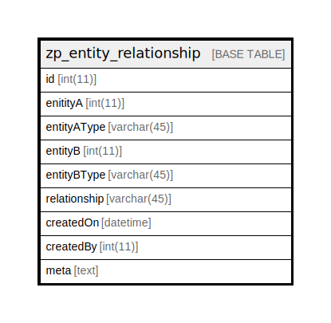

# zp_entity_relationship

## 概要

<details>
<summary><strong>テーブル定義</strong></summary>

```sql
CREATE TABLE `zp_entity_relationship` (
  `id` int(11) NOT NULL AUTO_INCREMENT,
  `enitityA` int(11) DEFAULT NULL,
  `entityAType` varchar(45) DEFAULT NULL,
  `entityB` int(11) DEFAULT NULL,
  `entityBType` varchar(45) DEFAULT NULL,
  `relationship` varchar(45) DEFAULT NULL,
  `createdOn` datetime DEFAULT NULL,
  `createdBy` int(11) DEFAULT NULL,
  `meta` text DEFAULT NULL,
  PRIMARY KEY (`id`),
  KEY `entityA` (`enitityA`,`entityAType`,`relationship`),
  KEY `entityB` (`entityB`,`entityBType`,`relationship`)
) ENGINE=InnoDB DEFAULT CHARSET=utf8mb4 COLLATE=utf8mb4_unicode_ci
```

</details>

## カラム一覧

| 名前           | タイプ         | デフォルト値       | Nullable | Extra Definition | 子テーブル      | 親テーブル      | コメント     |
| ------------ | ----------- | ------------ | -------- | ---------------- | ---------- | ---------- | -------- |
| id           | int(11)     |              | false    | auto_increment   |            |            |          |
| enitityA     | int(11)     | NULL         | true     |                  |            |            |          |
| entityAType  | varchar(45) | NULL         | true     |                  |            |            |          |
| entityB      | int(11)     | NULL         | true     |                  |            |            |          |
| entityBType  | varchar(45) | NULL         | true     |                  |            |            |          |
| relationship | varchar(45) | NULL         | true     |                  |            |            |          |
| createdOn    | datetime    | NULL         | true     |                  |            |            |          |
| createdBy    | int(11)     | NULL         | true     |                  |            |            |          |
| meta         | text        | NULL         | true     |                  |            |            |          |

## 制約一覧

| 名前      | タイプ         | 定義               |
| ------- | ----------- | ---------------- |
| PRIMARY | PRIMARY KEY | PRIMARY KEY (id) |

## INDEX一覧

| 名前      | 定義                                                            |
| ------- | ------------------------------------------------------------- |
| entityA | KEY entityA (enitityA, entityAType, relationship) USING BTREE |
| entityB | KEY entityB (entityB, entityBType, relationship) USING BTREE  |
| PRIMARY | PRIMARY KEY (id) USING BTREE                                  |

## ER図



---

> Generated by [tbls](https://github.com/k1LoW/tbls)
