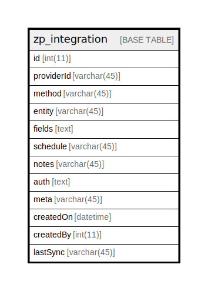

# zp_integration

## 概要

<details>
<summary><strong>テーブル定義</strong></summary>

```sql
CREATE TABLE `zp_integration` (
  `id` int(11) NOT NULL AUTO_INCREMENT,
  `providerId` varchar(45) DEFAULT NULL,
  `method` varchar(45) DEFAULT NULL,
  `entity` varchar(45) DEFAULT NULL,
  `fields` text DEFAULT NULL,
  `schedule` varchar(45) DEFAULT NULL,
  `notes` varchar(45) DEFAULT NULL,
  `auth` text DEFAULT NULL,
  `meta` varchar(45) DEFAULT NULL,
  `createdOn` datetime DEFAULT NULL,
  `createdBy` int(11) DEFAULT NULL,
  `lastSync` varchar(45) DEFAULT NULL,
  PRIMARY KEY (`id`)
) ENGINE=InnoDB DEFAULT CHARSET=utf8mb4 COLLATE=utf8mb4_unicode_ci
```

</details>

## カラム一覧

| 名前         | タイプ         | デフォルト値       | Nullable | Extra Definition | 子テーブル      | 親テーブル      | コメント     |
| ---------- | ----------- | ------------ | -------- | ---------------- | ---------- | ---------- | -------- |
| id         | int(11)     |              | false    | auto_increment   |            |            |          |
| providerId | varchar(45) | NULL         | true     |                  |            |            |          |
| method     | varchar(45) | NULL         | true     |                  |            |            |          |
| entity     | varchar(45) | NULL         | true     |                  |            |            |          |
| fields     | text        | NULL         | true     |                  |            |            |          |
| schedule   | varchar(45) | NULL         | true     |                  |            |            |          |
| notes      | varchar(45) | NULL         | true     |                  |            |            |          |
| auth       | text        | NULL         | true     |                  |            |            |          |
| meta       | varchar(45) | NULL         | true     |                  |            |            |          |
| createdOn  | datetime    | NULL         | true     |                  |            |            |          |
| createdBy  | int(11)     | NULL         | true     |                  |            |            |          |
| lastSync   | varchar(45) | NULL         | true     |                  |            |            |          |

## 制約一覧

| 名前      | タイプ         | 定義               |
| ------- | ----------- | ---------------- |
| PRIMARY | PRIMARY KEY | PRIMARY KEY (id) |

## INDEX一覧

| 名前      | 定義                           |
| ------- | ---------------------------- |
| PRIMARY | PRIMARY KEY (id) USING BTREE |

## ER図



---

> Generated by [tbls](https://github.com/k1LoW/tbls)
