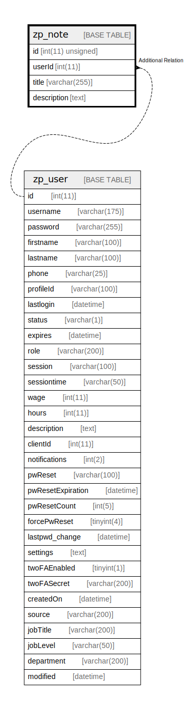

# zp_note

## 概要

<details>
<summary><strong>テーブル定義</strong></summary>

```sql
CREATE TABLE `zp_note` (
  `id` int(11) unsigned NOT NULL AUTO_INCREMENT,
  `userId` int(11) DEFAULT NULL,
  `title` varchar(255) DEFAULT NULL,
  `description` text DEFAULT NULL,
  PRIMARY KEY (`id`)
) ENGINE=InnoDB DEFAULT CHARSET=utf8mb4 COLLATE=utf8mb4_unicode_ci
```

</details>

## カラム一覧

| 名前          | タイプ              | デフォルト値       | Nullable | Extra Definition | 子テーブル      | 親テーブル                 | コメント     |
| ----------- | ---------------- | ------------ | -------- | ---------------- | ---------- | --------------------- | -------- |
| id          | int(11) unsigned |              | false    | auto_increment   |            |                       |          |
| userId      | int(11)          | NULL         | true     |                  |            | [zp_user](zp_user.md) |          |
| title       | varchar(255)     | NULL         | true     |                  |            |                       |          |
| description | text             | NULL         | true     |                  |            |                       |          |

## 制約一覧

| 名前      | タイプ         | 定義               |
| ------- | ----------- | ---------------- |
| PRIMARY | PRIMARY KEY | PRIMARY KEY (id) |

## INDEX一覧

| 名前      | 定義                           |
| ------- | ---------------------------- |
| PRIMARY | PRIMARY KEY (id) USING BTREE |

## ER図



---

> Generated by [tbls](https://github.com/k1LoW/tbls)
