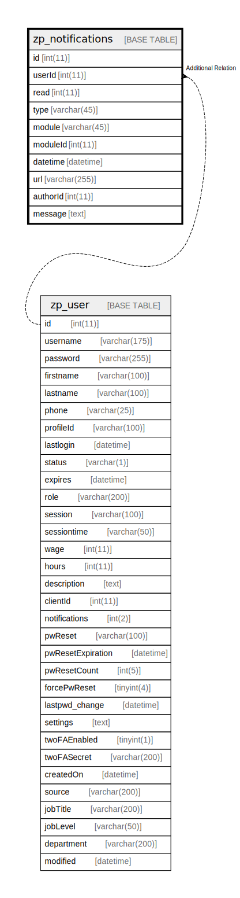

# zp_notifications

## 概要

<details>
<summary><strong>テーブル定義</strong></summary>

```sql
CREATE TABLE `zp_notifications` (
  `id` int(11) NOT NULL AUTO_INCREMENT,
  `userId` int(11) NOT NULL,
  `read` int(11) DEFAULT NULL,
  `type` varchar(45) DEFAULT NULL,
  `module` varchar(45) DEFAULT NULL,
  `moduleId` int(11) DEFAULT NULL,
  `datetime` datetime DEFAULT NULL,
  `url` varchar(255) DEFAULT NULL,
  `authorId` int(11) DEFAULT NULL,
  `message` text DEFAULT NULL,
  PRIMARY KEY (`id`),
  KEY `userId` (`userId`),
  KEY `userId,datetime` (`userId`,`datetime` DESC),
  KEY `userId,read` (`userId`,`read` DESC)
) ENGINE=InnoDB DEFAULT CHARSET=utf8mb4 COLLATE=utf8mb4_unicode_ci
```

</details>

## カラム一覧

| 名前       | タイプ          | デフォルト値       | Nullable | Extra Definition | 子テーブル      | 親テーブル                 | コメント     |
| -------- | ------------ | ------------ | -------- | ---------------- | ---------- | --------------------- | -------- |
| id       | int(11)      |              | false    | auto_increment   |            |                       |          |
| userId   | int(11)      |              | false    |                  |            | [zp_user](zp_user.md) |          |
| read     | int(11)      | NULL         | true     |                  |            |                       |          |
| type     | varchar(45)  | NULL         | true     |                  |            |                       |          |
| module   | varchar(45)  | NULL         | true     |                  |            |                       |          |
| moduleId | int(11)      | NULL         | true     |                  |            |                       |          |
| datetime | datetime     | NULL         | true     |                  |            |                       |          |
| url      | varchar(255) | NULL         | true     |                  |            |                       |          |
| authorId | int(11)      | NULL         | true     |                  |            |                       |          |
| message  | text         | NULL         | true     |                  |            |                       |          |

## 制約一覧

| 名前      | タイプ         | 定義               |
| ------- | ----------- | ---------------- |
| PRIMARY | PRIMARY KEY | PRIMARY KEY (id) |

## INDEX一覧

| 名前              | 定義                                                 |
| --------------- | -------------------------------------------------- |
| userId          | KEY userId (userId) USING BTREE                    |
| userId,datetime | KEY userId,datetime (userId, datetime) USING BTREE |
| userId,read     | KEY userId,read (userId, read) USING BTREE         |
| PRIMARY         | PRIMARY KEY (id) USING BTREE                       |

## ER図



---

> Generated by [tbls](https://github.com/k1LoW/tbls)
