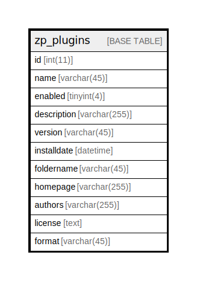

# zp_plugins

## 概要

<details>
<summary><strong>テーブル定義</strong></summary>

```sql
CREATE TABLE `zp_plugins` (
  `id` int(11) NOT NULL AUTO_INCREMENT,
  `name` varchar(45) DEFAULT NULL,
  `enabled` tinyint(4) DEFAULT NULL,
  `description` varchar(255) DEFAULT NULL,
  `version` varchar(45) DEFAULT NULL,
  `installdate` datetime DEFAULT NULL,
  `foldername` varchar(45) DEFAULT NULL,
  `homepage` varchar(255) DEFAULT NULL,
  `authors` varchar(255) DEFAULT NULL,
  `license` text DEFAULT NULL,
  `format` varchar(45) DEFAULT NULL,
  PRIMARY KEY (`id`)
) ENGINE=InnoDB DEFAULT CHARSET=utf8mb4 COLLATE=utf8mb4_unicode_ci
```

</details>

## カラム一覧

| 名前          | タイプ          | デフォルト値       | Nullable | Extra Definition | 子テーブル      | 親テーブル      | コメント     |
| ----------- | ------------ | ------------ | -------- | ---------------- | ---------- | ---------- | -------- |
| id          | int(11)      |              | false    | auto_increment   |            |            |          |
| name        | varchar(45)  | NULL         | true     |                  |            |            |          |
| enabled     | tinyint(4)   | NULL         | true     |                  |            |            |          |
| description | varchar(255) | NULL         | true     |                  |            |            |          |
| version     | varchar(45)  | NULL         | true     |                  |            |            |          |
| installdate | datetime     | NULL         | true     |                  |            |            |          |
| foldername  | varchar(45)  | NULL         | true     |                  |            |            |          |
| homepage    | varchar(255) | NULL         | true     |                  |            |            |          |
| authors     | varchar(255) | NULL         | true     |                  |            |            |          |
| license     | text         | NULL         | true     |                  |            |            |          |
| format      | varchar(45)  | NULL         | true     |                  |            |            |          |

## 制約一覧

| 名前      | タイプ         | 定義               |
| ------- | ----------- | ---------------- |
| PRIMARY | PRIMARY KEY | PRIMARY KEY (id) |

## INDEX一覧

| 名前      | 定義                           |
| ------- | ---------------------------- |
| PRIMARY | PRIMARY KEY (id) USING BTREE |

## ER図



---

> Generated by [tbls](https://github.com/k1LoW/tbls)
