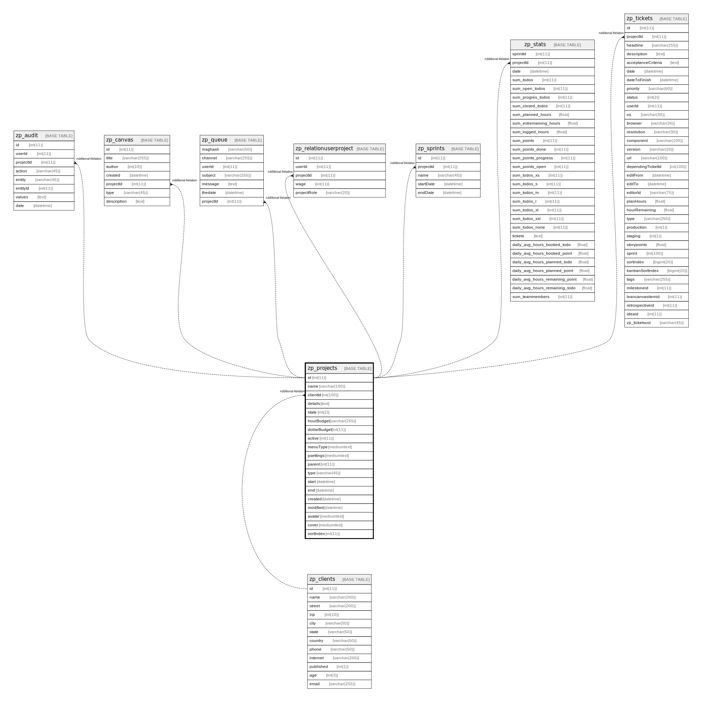

# zp_projects

## 概要

<details>
<summary><strong>テーブル定義</strong></summary>

```sql
CREATE TABLE `zp_projects` (
  `id` int(11) NOT NULL AUTO_INCREMENT,
  `name` varchar(100) DEFAULT NULL,
  `clientId` int(100) DEFAULT NULL,
  `details` text DEFAULT NULL,
  `state` int(2) DEFAULT NULL,
  `hourBudget` varchar(255) NOT NULL,
  `dollarBudget` int(11) DEFAULT NULL,
  `active` int(11) DEFAULT NULL,
  `menuType` mediumtext DEFAULT NULL,
  `psettings` mediumtext DEFAULT NULL,
  `parent` int(11) DEFAULT NULL,
  `type` varchar(45) DEFAULT NULL,
  `start` datetime DEFAULT NULL,
  `end` datetime DEFAULT NULL,
  `created` datetime DEFAULT NULL,
  `modified` datetime DEFAULT NULL,
  `avatar` mediumtext DEFAULT NULL,
  `cover` mediumtext DEFAULT NULL,
  `sortIndex` int(11) DEFAULT NULL,
  PRIMARY KEY (`id`)
) ENGINE=InnoDB AUTO_INCREMENT=[Redacted by tbls] DEFAULT CHARSET=utf8mb4 COLLATE=utf8mb4_unicode_ci
```

</details>

## カラム一覧

| 名前           | タイプ          | デフォルト値       | Nullable | Extra Definition | 子テーブル                                                                                                                                                                                                         | 親テーブル                       | コメント     |
| ------------ | ------------ | ------------ | -------- | ---------------- | ------------------------------------------------------------------------------------------------------------------------------------------------------------------------------------------------------------- | --------------------------- | -------- |
| id           | int(11)      |              | false    | auto_increment   | [zp_audit](zp_audit.md) [zp_canvas](zp_canvas.md) [zp_queue](zp_queue.md) [zp_relationuserproject](zp_relationuserproject.md) [zp_sprints](zp_sprints.md) [zp_stats](zp_stats.md) [zp_tickets](zp_tickets.md) |                             |          |
| name         | varchar(100) | NULL         | true     |                  |                                                                                                                                                                                                               |                             |          |
| clientId     | int(100)     | NULL         | true     |                  |                                                                                                                                                                                                               | [zp_clients](zp_clients.md) |          |
| details      | text         | NULL         | true     |                  |                                                                                                                                                                                                               |                             |          |
| state        | int(2)       | NULL         | true     |                  |                                                                                                                                                                                                               |                             |          |
| hourBudget   | varchar(255) |              | false    |                  |                                                                                                                                                                                                               |                             |          |
| dollarBudget | int(11)      | NULL         | true     |                  |                                                                                                                                                                                                               |                             |          |
| active       | int(11)      | NULL         | true     |                  |                                                                                                                                                                                                               |                             |          |
| menuType     | mediumtext   | NULL         | true     |                  |                                                                                                                                                                                                               |                             |          |
| psettings    | mediumtext   | NULL         | true     |                  |                                                                                                                                                                                                               |                             |          |
| parent       | int(11)      | NULL         | true     |                  |                                                                                                                                                                                                               |                             |          |
| type         | varchar(45)  | NULL         | true     |                  |                                                                                                                                                                                                               |                             |          |
| start        | datetime     | NULL         | true     |                  |                                                                                                                                                                                                               |                             |          |
| end          | datetime     | NULL         | true     |                  |                                                                                                                                                                                                               |                             |          |
| created      | datetime     | NULL         | true     |                  |                                                                                                                                                                                                               |                             |          |
| modified     | datetime     | NULL         | true     |                  |                                                                                                                                                                                                               |                             |          |
| avatar       | mediumtext   | NULL         | true     |                  |                                                                                                                                                                                                               |                             |          |
| cover        | mediumtext   | NULL         | true     |                  |                                                                                                                                                                                                               |                             |          |
| sortIndex    | int(11)      | NULL         | true     |                  |                                                                                                                                                                                                               |                             |          |

## 制約一覧

| 名前      | タイプ         | 定義               |
| ------- | ----------- | ---------------- |
| PRIMARY | PRIMARY KEY | PRIMARY KEY (id) |

## INDEX一覧

| 名前      | 定義                           |
| ------- | ---------------------------- |
| PRIMARY | PRIMARY KEY (id) USING BTREE |

## ER図



---

> Generated by [tbls](https://github.com/k1LoW/tbls)
