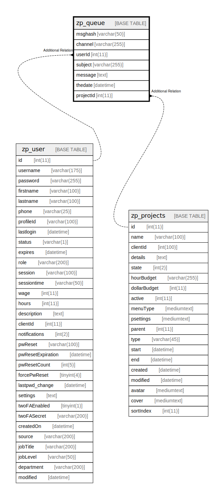

# zp_queue

## 概要

<details>
<summary><strong>テーブル定義</strong></summary>

```sql
CREATE TABLE `zp_queue` (
  `msghash` varchar(50) NOT NULL,
  `channel` varchar(255) DEFAULT NULL,
  `userId` int(11) NOT NULL,
  `subject` varchar(255) DEFAULT NULL,
  `message` text NOT NULL,
  `thedate` datetime NOT NULL,
  `projectId` int(11) NOT NULL,
  PRIMARY KEY (`msghash`),
  KEY `projectId` (`projectId`),
  KEY `userId` (`userId`)
) ENGINE=InnoDB DEFAULT CHARSET=utf8mb4 COLLATE=utf8mb4_unicode_ci
```

</details>

## カラム一覧

| 名前        | タイプ          | デフォルト値       | Nullable | 子テーブル      | 親テーブル                         | コメント     |
| --------- | ------------ | ------------ | -------- | ---------- | ----------------------------- | -------- |
| msghash   | varchar(50)  |              | false    |            |                               |          |
| channel   | varchar(255) | NULL         | true     |            |                               |          |
| userId    | int(11)      |              | false    |            | [zp_user](zp_user.md)         |          |
| subject   | varchar(255) | NULL         | true     |            |                               |          |
| message   | text         |              | false    |            |                               |          |
| thedate   | datetime     |              | false    |            |                               |          |
| projectId | int(11)      |              | false    |            | [zp_projects](zp_projects.md) |          |

## 制約一覧

| 名前      | タイプ         | 定義                    |
| ------- | ----------- | --------------------- |
| PRIMARY | PRIMARY KEY | PRIMARY KEY (msghash) |

## INDEX一覧

| 名前        | 定義                                    |
| --------- | ------------------------------------- |
| projectId | KEY projectId (projectId) USING BTREE |
| userId    | KEY userId (userId) USING BTREE       |
| PRIMARY   | PRIMARY KEY (msghash) USING BTREE     |

## ER図



---

> Generated by [tbls](https://github.com/k1LoW/tbls)
