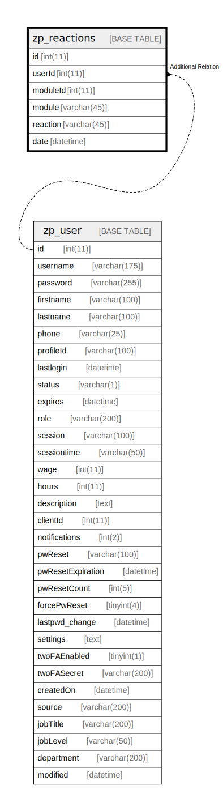

# zp_reactions

## 概要

<details>
<summary><strong>テーブル定義</strong></summary>

```sql
CREATE TABLE `zp_reactions` (
  `id` int(11) NOT NULL AUTO_INCREMENT,
  `userId` int(11) DEFAULT NULL,
  `moduleId` int(11) DEFAULT NULL,
  `module` varchar(45) DEFAULT NULL,
  `reaction` varchar(45) DEFAULT NULL,
  `date` datetime DEFAULT NULL,
  PRIMARY KEY (`id`),
  KEY `entity` (`moduleId`,`module`,`reaction`),
  KEY `user` (`userId`,`moduleId`,`module`,`reaction`)
) ENGINE=InnoDB DEFAULT CHARSET=utf8mb4 COLLATE=utf8mb4_unicode_ci
```

</details>

## カラム一覧

| 名前       | タイプ         | デフォルト値       | Nullable | Extra Definition | 子テーブル      | 親テーブル                 | コメント     |
| -------- | ----------- | ------------ | -------- | ---------------- | ---------- | --------------------- | -------- |
| id       | int(11)     |              | false    | auto_increment   |            |                       |          |
| userId   | int(11)     | NULL         | true     |                  |            | [zp_user](zp_user.md) |          |
| moduleId | int(11)     | NULL         | true     |                  |            |                       |          |
| module   | varchar(45) | NULL         | true     |                  |            |                       |          |
| reaction | varchar(45) | NULL         | true     |                  |            |                       |          |
| date     | datetime    | NULL         | true     |                  |            |                       |          |

## 制約一覧

| 名前      | タイプ         | 定義               |
| ------- | ----------- | ---------------- |
| PRIMARY | PRIMARY KEY | PRIMARY KEY (id) |

## INDEX一覧

| 名前      | 定義                                                        |
| ------- | --------------------------------------------------------- |
| entity  | KEY entity (moduleId, module, reaction) USING BTREE       |
| user    | KEY user (userId, moduleId, module, reaction) USING BTREE |
| PRIMARY | PRIMARY KEY (id) USING BTREE                              |

## ER図



---

> Generated by [tbls](https://github.com/k1LoW/tbls)
