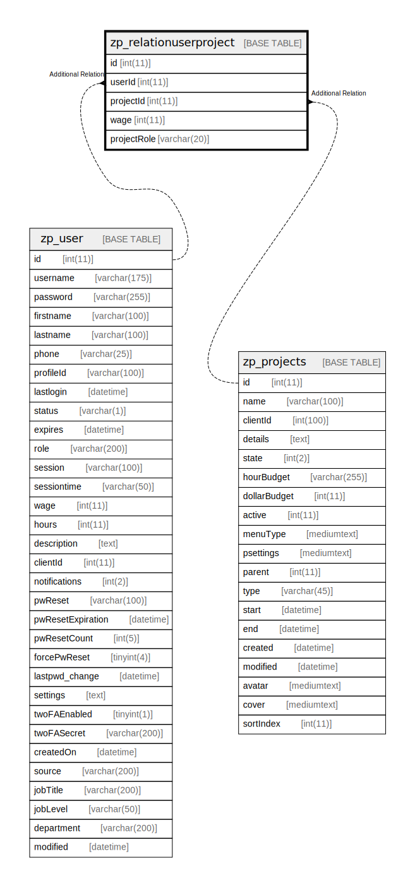

# zp_relationuserproject

## 概要

<details>
<summary><strong>テーブル定義</strong></summary>

```sql
CREATE TABLE `zp_relationuserproject` (
  `id` int(11) NOT NULL AUTO_INCREMENT,
  `userId` int(11) DEFAULT NULL,
  `projectId` int(11) DEFAULT NULL,
  `wage` int(11) DEFAULT NULL,
  `projectRole` varchar(20) DEFAULT NULL,
  PRIMARY KEY (`id`),
  KEY `zp_relationuserproject_projectId_index` (`projectId`),
  KEY `zp_relationuserproject_userId_index` (`userId`)
) ENGINE=InnoDB AUTO_INCREMENT=[Redacted by tbls] DEFAULT CHARSET=utf8mb4 COLLATE=utf8mb4_unicode_ci
```

</details>

## カラム一覧

| 名前          | タイプ         | デフォルト値       | Nullable | Extra Definition | 子テーブル      | 親テーブル                         | コメント     |
| ----------- | ----------- | ------------ | -------- | ---------------- | ---------- | ----------------------------- | -------- |
| id          | int(11)     |              | false    | auto_increment   |            |                               |          |
| userId      | int(11)     | NULL         | true     |                  |            | [zp_user](zp_user.md)         |          |
| projectId   | int(11)     | NULL         | true     |                  |            | [zp_projects](zp_projects.md) |          |
| wage        | int(11)     | NULL         | true     |                  |            |                               |          |
| projectRole | varchar(20) | NULL         | true     |                  |            |                               |          |

## 制約一覧

| 名前      | タイプ         | 定義               |
| ------- | ----------- | ---------------- |
| PRIMARY | PRIMARY KEY | PRIMARY KEY (id) |

## INDEX一覧

| 名前                                     | 定義                                                                 |
| -------------------------------------- | ------------------------------------------------------------------ |
| zp_relationuserproject_projectId_index | KEY zp_relationuserproject_projectId_index (projectId) USING BTREE |
| zp_relationuserproject_userId_index    | KEY zp_relationuserproject_userId_index (userId) USING BTREE       |
| PRIMARY                                | PRIMARY KEY (id) USING BTREE                                       |

## ER図



---

> Generated by [tbls](https://github.com/k1LoW/tbls)
