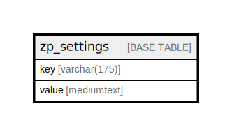

# zp_settings

## 概要

<details>
<summary><strong>テーブル定義</strong></summary>

```sql
CREATE TABLE `zp_settings` (
  `key` varchar(175) NOT NULL,
  `value` mediumtext DEFAULT NULL,
  PRIMARY KEY (`key`)
) ENGINE=InnoDB DEFAULT CHARSET=utf8mb4 COLLATE=utf8mb4_unicode_ci
```

</details>

## カラム一覧

| 名前    | タイプ          | デフォルト値       | Nullable | 子テーブル      | 親テーブル      | コメント     |
| ----- | ------------ | ------------ | -------- | ---------- | ---------- | -------- |
| key   | varchar(175) |              | false    |            |            |          |
| value | mediumtext   | NULL         | true     |            |            |          |

## 制約一覧

| 名前      | タイプ         | 定義                |
| ------- | ----------- | ----------------- |
| PRIMARY | PRIMARY KEY | PRIMARY KEY (key) |

## INDEX一覧

| 名前      | 定義                            |
| ------- | ----------------------------- |
| PRIMARY | PRIMARY KEY (key) USING BTREE |

## ER図



---

> Generated by [tbls](https://github.com/k1LoW/tbls)
