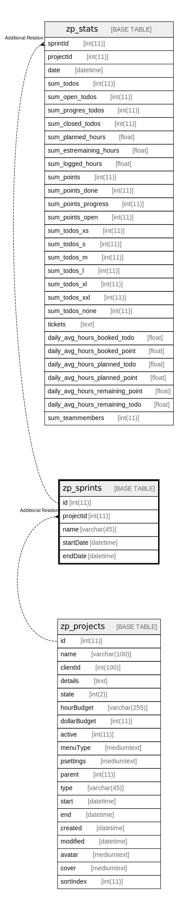

# zp_sprints

## 概要

<details>
<summary><strong>テーブル定義</strong></summary>

```sql
CREATE TABLE `zp_sprints` (
  `id` int(11) NOT NULL AUTO_INCREMENT,
  `projectId` int(11) DEFAULT NULL,
  `name` varchar(45) DEFAULT NULL,
  `startDate` datetime DEFAULT NULL,
  `endDate` datetime DEFAULT NULL,
  PRIMARY KEY (`id`)
) ENGINE=InnoDB DEFAULT CHARSET=utf8mb4 COLLATE=utf8mb4_unicode_ci
```

</details>

## カラム一覧

| 名前        | タイプ         | デフォルト値       | Nullable | Extra Definition | 子テーブル                   | 親テーブル                         | コメント     |
| --------- | ----------- | ------------ | -------- | ---------------- | ----------------------- | ----------------------------- | -------- |
| id        | int(11)     |              | false    | auto_increment   | [zp_stats](zp_stats.md) |                               |          |
| projectId | int(11)     | NULL         | true     |                  |                         | [zp_projects](zp_projects.md) |          |
| name      | varchar(45) | NULL         | true     |                  |                         |                               |          |
| startDate | datetime    | NULL         | true     |                  |                         |                               |          |
| endDate   | datetime    | NULL         | true     |                  |                         |                               |          |

## 制約一覧

| 名前      | タイプ         | 定義               |
| ------- | ----------- | ---------------- |
| PRIMARY | PRIMARY KEY | PRIMARY KEY (id) |

## INDEX一覧

| 名前      | 定義                           |
| ------- | ---------------------------- |
| PRIMARY | PRIMARY KEY (id) USING BTREE |

## ER図



---

> Generated by [tbls](https://github.com/k1LoW/tbls)
