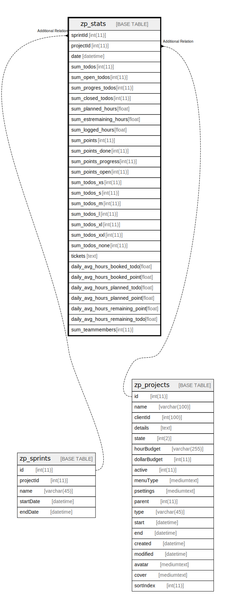

# zp_stats

## 概要

<details>
<summary><strong>テーブル定義</strong></summary>

```sql
CREATE TABLE `zp_stats` (
  `sprintId` int(11) DEFAULT NULL,
  `projectId` int(11) DEFAULT NULL,
  `date` datetime DEFAULT NULL,
  `sum_todos` int(11) DEFAULT NULL,
  `sum_open_todos` int(11) DEFAULT NULL,
  `sum_progres_todos` int(11) DEFAULT NULL,
  `sum_closed_todos` int(11) DEFAULT NULL,
  `sum_planned_hours` float DEFAULT NULL,
  `sum_estremaining_hours` float DEFAULT NULL,
  `sum_logged_hours` float DEFAULT NULL,
  `sum_points` int(11) DEFAULT NULL,
  `sum_points_done` int(11) DEFAULT NULL,
  `sum_points_progress` int(11) DEFAULT NULL,
  `sum_points_open` int(11) DEFAULT NULL,
  `sum_todos_xs` int(11) DEFAULT NULL,
  `sum_todos_s` int(11) DEFAULT NULL,
  `sum_todos_m` int(11) DEFAULT NULL,
  `sum_todos_l` int(11) DEFAULT NULL,
  `sum_todos_xl` int(11) DEFAULT NULL,
  `sum_todos_xxl` int(11) DEFAULT NULL,
  `sum_todos_none` int(11) DEFAULT NULL,
  `tickets` text DEFAULT NULL,
  `daily_avg_hours_booked_todo` float DEFAULT NULL,
  `daily_avg_hours_booked_point` float DEFAULT NULL,
  `daily_avg_hours_planned_todo` float DEFAULT NULL,
  `daily_avg_hours_planned_point` float DEFAULT NULL,
  `daily_avg_hours_remaining_point` float DEFAULT NULL,
  `daily_avg_hours_remaining_todo` float DEFAULT NULL,
  `sum_teammembers` int(11) DEFAULT NULL,
  KEY `projectId` (`projectId`,`sprintId`)
) ENGINE=InnoDB DEFAULT CHARSET=utf8mb4 COLLATE=utf8mb4_unicode_ci
```

</details>

## カラム一覧

| 名前                              | タイプ      | デフォルト値       | Nullable | 子テーブル      | 親テーブル                         | コメント     |
| ------------------------------- | -------- | ------------ | -------- | ---------- | ----------------------------- | -------- |
| sprintId                        | int(11)  | NULL         | true     |            | [zp_sprints](zp_sprints.md)   |          |
| projectId                       | int(11)  | NULL         | true     |            | [zp_projects](zp_projects.md) |          |
| date                            | datetime | NULL         | true     |            |                               |          |
| sum_todos                       | int(11)  | NULL         | true     |            |                               |          |
| sum_open_todos                  | int(11)  | NULL         | true     |            |                               |          |
| sum_progres_todos               | int(11)  | NULL         | true     |            |                               |          |
| sum_closed_todos                | int(11)  | NULL         | true     |            |                               |          |
| sum_planned_hours               | float    | NULL         | true     |            |                               |          |
| sum_estremaining_hours          | float    | NULL         | true     |            |                               |          |
| sum_logged_hours                | float    | NULL         | true     |            |                               |          |
| sum_points                      | int(11)  | NULL         | true     |            |                               |          |
| sum_points_done                 | int(11)  | NULL         | true     |            |                               |          |
| sum_points_progress             | int(11)  | NULL         | true     |            |                               |          |
| sum_points_open                 | int(11)  | NULL         | true     |            |                               |          |
| sum_todos_xs                    | int(11)  | NULL         | true     |            |                               |          |
| sum_todos_s                     | int(11)  | NULL         | true     |            |                               |          |
| sum_todos_m                     | int(11)  | NULL         | true     |            |                               |          |
| sum_todos_l                     | int(11)  | NULL         | true     |            |                               |          |
| sum_todos_xl                    | int(11)  | NULL         | true     |            |                               |          |
| sum_todos_xxl                   | int(11)  | NULL         | true     |            |                               |          |
| sum_todos_none                  | int(11)  | NULL         | true     |            |                               |          |
| tickets                         | text     | NULL         | true     |            |                               |          |
| daily_avg_hours_booked_todo     | float    | NULL         | true     |            |                               |          |
| daily_avg_hours_booked_point    | float    | NULL         | true     |            |                               |          |
| daily_avg_hours_planned_todo    | float    | NULL         | true     |            |                               |          |
| daily_avg_hours_planned_point   | float    | NULL         | true     |            |                               |          |
| daily_avg_hours_remaining_point | float    | NULL         | true     |            |                               |          |
| daily_avg_hours_remaining_todo  | float    | NULL         | true     |            |                               |          |
| sum_teammembers                 | int(11)  | NULL         | true     |            |                               |          |

## INDEX一覧

| 名前        | 定義                                              |
| --------- | ----------------------------------------------- |
| projectId | KEY projectId (projectId, sprintId) USING BTREE |

## ER図



---

> Generated by [tbls](https://github.com/k1LoW/tbls)
