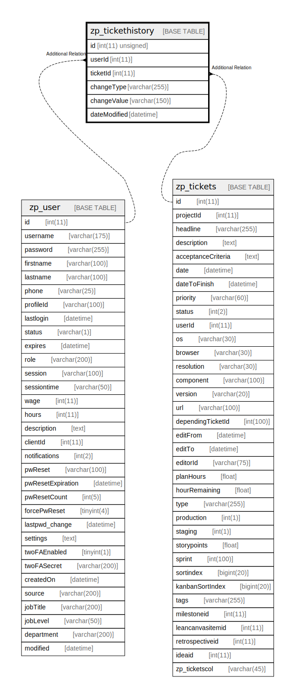

# zp_tickethistory

## 概要

<details>
<summary><strong>テーブル定義</strong></summary>

```sql
CREATE TABLE `zp_tickethistory` (
  `id` int(11) unsigned NOT NULL AUTO_INCREMENT,
  `userId` int(11) DEFAULT NULL,
  `ticketId` int(11) DEFAULT NULL,
  `changeType` varchar(255) DEFAULT NULL,
  `changeValue` varchar(150) DEFAULT NULL,
  `dateModified` datetime DEFAULT NULL,
  PRIMARY KEY (`id`)
) ENGINE=InnoDB DEFAULT CHARSET=utf8mb4 COLLATE=utf8mb4_unicode_ci
```

</details>

## カラム一覧

| 名前           | タイプ              | デフォルト値       | Nullable | Extra Definition | 子テーブル      | 親テーブル                       | コメント     |
| ------------ | ---------------- | ------------ | -------- | ---------------- | ---------- | --------------------------- | -------- |
| id           | int(11) unsigned |              | false    | auto_increment   |            |                             |          |
| userId       | int(11)          | NULL         | true     |                  |            | [zp_user](zp_user.md)       |          |
| ticketId     | int(11)          | NULL         | true     |                  |            | [zp_tickets](zp_tickets.md) |          |
| changeType   | varchar(255)     | NULL         | true     |                  |            |                             |          |
| changeValue  | varchar(150)     | NULL         | true     |                  |            |                             |          |
| dateModified | datetime         | NULL         | true     |                  |            |                             |          |

## 制約一覧

| 名前      | タイプ         | 定義               |
| ------- | ----------- | ---------------- |
| PRIMARY | PRIMARY KEY | PRIMARY KEY (id) |

## INDEX一覧

| 名前      | 定義                           |
| ------- | ---------------------------- |
| PRIMARY | PRIMARY KEY (id) USING BTREE |

## ER図



---

> Generated by [tbls](https://github.com/k1LoW/tbls)
