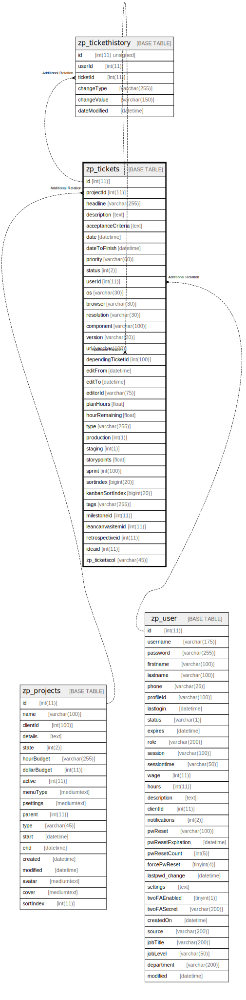

# zp_tickets

## 概要

<details>
<summary><strong>テーブル定義</strong></summary>

```sql
CREATE TABLE `zp_tickets` (
  `id` int(11) NOT NULL AUTO_INCREMENT,
  `projectId` int(11) DEFAULT NULL,
  `headline` varchar(255) DEFAULT NULL,
  `description` text DEFAULT NULL,
  `acceptanceCriteria` text DEFAULT NULL,
  `date` datetime DEFAULT NULL,
  `dateToFinish` datetime DEFAULT NULL,
  `priority` varchar(60) DEFAULT NULL,
  `status` int(2) DEFAULT NULL,
  `userId` int(11) DEFAULT NULL,
  `os` varchar(30) DEFAULT NULL,
  `browser` varchar(30) DEFAULT NULL,
  `resolution` varchar(30) DEFAULT NULL,
  `component` varchar(100) DEFAULT NULL,
  `version` varchar(20) DEFAULT NULL,
  `url` varchar(100) DEFAULT NULL,
  `dependingTicketId` int(100) DEFAULT NULL,
  `editFrom` datetime DEFAULT NULL,
  `editTo` datetime DEFAULT NULL,
  `editorId` varchar(75) DEFAULT NULL,
  `planHours` float DEFAULT NULL,
  `hourRemaining` float DEFAULT NULL,
  `type` varchar(255) DEFAULT NULL,
  `production` int(1) DEFAULT 0,
  `staging` int(1) DEFAULT 0,
  `storypoints` float DEFAULT NULL,
  `sprint` int(100) DEFAULT NULL,
  `sortindex` bigint(20) DEFAULT NULL,
  `kanbanSortIndex` bigint(20) DEFAULT NULL,
  `tags` varchar(255) DEFAULT NULL,
  `milestoneid` int(11) DEFAULT NULL,
  `leancanvasitemid` int(11) DEFAULT NULL,
  `retrospectiveid` int(11) DEFAULT NULL,
  `ideaid` int(11) DEFAULT NULL,
  `zp_ticketscol` varchar(45) DEFAULT NULL,
  PRIMARY KEY (`id`),
  KEY `ProjectUserId` (`projectId`,`userId`),
  KEY `StatusSprint` (`status`,`sprint`),
  KEY `Sorting` (`sortindex`)
) ENGINE=InnoDB AUTO_INCREMENT=[Redacted by tbls] DEFAULT CHARSET=utf8mb4 COLLATE=utf8mb4_unicode_ci
```

</details>

## カラム一覧

| 名前                 | タイプ          | デフォルト値       | Nullable | Extra Definition | 子テーブル                                                               | 親テーブル                         | コメント     |
| ------------------ | ------------ | ------------ | -------- | ---------------- | ------------------------------------------------------------------- | ----------------------------- | -------- |
| id                 | int(11)      |              | false    | auto_increment   | [zp_tickethistory](zp_tickethistory.md) [zp_tickets](zp_tickets.md) |                               |          |
| projectId          | int(11)      | NULL         | true     |                  |                                                                     | [zp_projects](zp_projects.md) |          |
| headline           | varchar(255) | NULL         | true     |                  |                                                                     |                               |          |
| description        | text         | NULL         | true     |                  |                                                                     |                               |          |
| acceptanceCriteria | text         | NULL         | true     |                  |                                                                     |                               |          |
| date               | datetime     | NULL         | true     |                  |                                                                     |                               |          |
| dateToFinish       | datetime     | NULL         | true     |                  |                                                                     |                               |          |
| priority           | varchar(60)  | NULL         | true     |                  |                                                                     |                               |          |
| status             | int(2)       | NULL         | true     |                  |                                                                     |                               |          |
| userId             | int(11)      | NULL         | true     |                  |                                                                     | [zp_user](zp_user.md)         |          |
| os                 | varchar(30)  | NULL         | true     |                  |                                                                     |                               |          |
| browser            | varchar(30)  | NULL         | true     |                  |                                                                     |                               |          |
| resolution         | varchar(30)  | NULL         | true     |                  |                                                                     |                               |          |
| component          | varchar(100) | NULL         | true     |                  |                                                                     |                               |          |
| version            | varchar(20)  | NULL         | true     |                  |                                                                     |                               |          |
| url                | varchar(100) | NULL         | true     |                  |                                                                     |                               |          |
| dependingTicketId  | int(100)     | NULL         | true     |                  |                                                                     | [zp_tickets](zp_tickets.md)   |          |
| editFrom           | datetime     | NULL         | true     |                  |                                                                     |                               |          |
| editTo             | datetime     | NULL         | true     |                  |                                                                     |                               |          |
| editorId           | varchar(75)  | NULL         | true     |                  |                                                                     |                               |          |
| planHours          | float        | NULL         | true     |                  |                                                                     |                               |          |
| hourRemaining      | float        | NULL         | true     |                  |                                                                     |                               |          |
| type               | varchar(255) | NULL         | true     |                  |                                                                     |                               |          |
| production         | int(1)       | 0            | true     |                  |                                                                     |                               |          |
| staging            | int(1)       | 0            | true     |                  |                                                                     |                               |          |
| storypoints        | float        | NULL         | true     |                  |                                                                     |                               |          |
| sprint             | int(100)     | NULL         | true     |                  |                                                                     |                               |          |
| sortindex          | bigint(20)   | NULL         | true     |                  |                                                                     |                               |          |
| kanbanSortIndex    | bigint(20)   | NULL         | true     |                  |                                                                     |                               |          |
| tags               | varchar(255) | NULL         | true     |                  |                                                                     |                               |          |
| milestoneid        | int(11)      | NULL         | true     |                  |                                                                     |                               |          |
| leancanvasitemid   | int(11)      | NULL         | true     |                  |                                                                     |                               |          |
| retrospectiveid    | int(11)      | NULL         | true     |                  |                                                                     |                               |          |
| ideaid             | int(11)      | NULL         | true     |                  |                                                                     |                               |          |
| zp_ticketscol      | varchar(45)  | NULL         | true     |                  |                                                                     |                               |          |

## 制約一覧

| 名前      | タイプ         | 定義               |
| ------- | ----------- | ---------------- |
| PRIMARY | PRIMARY KEY | PRIMARY KEY (id) |

## INDEX一覧

| 名前            | 定義                                                |
| ------------- | ------------------------------------------------- |
| ProjectUserId | KEY ProjectUserId (projectId, userId) USING BTREE |
| Sorting       | KEY Sorting (sortindex) USING BTREE               |
| StatusSprint  | KEY StatusSprint (status, sprint) USING BTREE     |
| PRIMARY       | PRIMARY KEY (id) USING BTREE                      |

## ER図



---

> Generated by [tbls](https://github.com/k1LoW/tbls)
