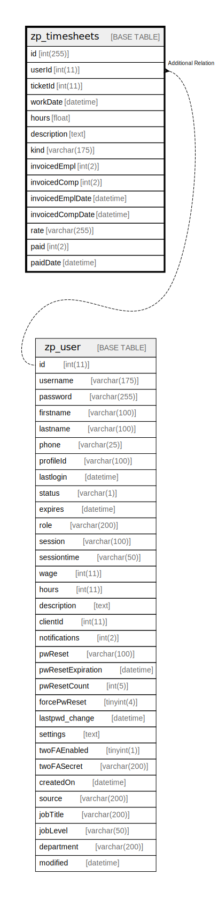

# zp_timesheets

## 概要

<details>
<summary><strong>テーブル定義</strong></summary>

```sql
CREATE TABLE `zp_timesheets` (
  `id` int(255) NOT NULL AUTO_INCREMENT,
  `userId` int(11) DEFAULT NULL,
  `ticketId` int(11) DEFAULT NULL,
  `workDate` datetime DEFAULT NULL,
  `hours` float DEFAULT NULL,
  `description` text DEFAULT NULL,
  `kind` varchar(175) DEFAULT NULL,
  `invoicedEmpl` int(2) DEFAULT NULL,
  `invoicedComp` int(2) DEFAULT NULL,
  `invoicedEmplDate` datetime DEFAULT NULL,
  `invoicedCompDate` datetime DEFAULT NULL,
  `rate` varchar(255) DEFAULT NULL,
  `paid` int(2) DEFAULT NULL,
  `paidDate` datetime DEFAULT NULL,
  PRIMARY KEY (`id`),
  UNIQUE KEY `Unique` (`userId`,`ticketId`,`workDate`,`kind`)
) ENGINE=InnoDB DEFAULT CHARSET=utf8mb4 COLLATE=utf8mb4_unicode_ci
```

</details>

## カラム一覧

| 名前               | タイプ          | デフォルト値       | Nullable | Extra Definition | 子テーブル      | 親テーブル                 | コメント     |
| ---------------- | ------------ | ------------ | -------- | ---------------- | ---------- | --------------------- | -------- |
| id               | int(255)     |              | false    | auto_increment   |            |                       |          |
| userId           | int(11)      | NULL         | true     |                  |            | [zp_user](zp_user.md) |          |
| ticketId         | int(11)      | NULL         | true     |                  |            |                       |          |
| workDate         | datetime     | NULL         | true     |                  |            |                       |          |
| hours            | float        | NULL         | true     |                  |            |                       |          |
| description      | text         | NULL         | true     |                  |            |                       |          |
| kind             | varchar(175) | NULL         | true     |                  |            |                       |          |
| invoicedEmpl     | int(2)       | NULL         | true     |                  |            |                       |          |
| invoicedComp     | int(2)       | NULL         | true     |                  |            |                       |          |
| invoicedEmplDate | datetime     | NULL         | true     |                  |            |                       |          |
| invoicedCompDate | datetime     | NULL         | true     |                  |            |                       |          |
| rate             | varchar(255) | NULL         | true     |                  |            |                       |          |
| paid             | int(2)       | NULL         | true     |                  |            |                       |          |
| paidDate         | datetime     | NULL         | true     |                  |            |                       |          |

## 制約一覧

| 名前      | タイプ         | 定義                                                   |
| ------- | ----------- | ---------------------------------------------------- |
| PRIMARY | PRIMARY KEY | PRIMARY KEY (id)                                     |
| Unique  | UNIQUE      | UNIQUE KEY Unique (userId, ticketId, workDate, kind) |

## INDEX一覧

| 名前      | 定義                                                               |
| ------- | ---------------------------------------------------------------- |
| PRIMARY | PRIMARY KEY (id) USING BTREE                                     |
| Unique  | UNIQUE KEY Unique (userId, ticketId, workDate, kind) USING BTREE |

## ER図



---

> Generated by [tbls](https://github.com/k1LoW/tbls)
