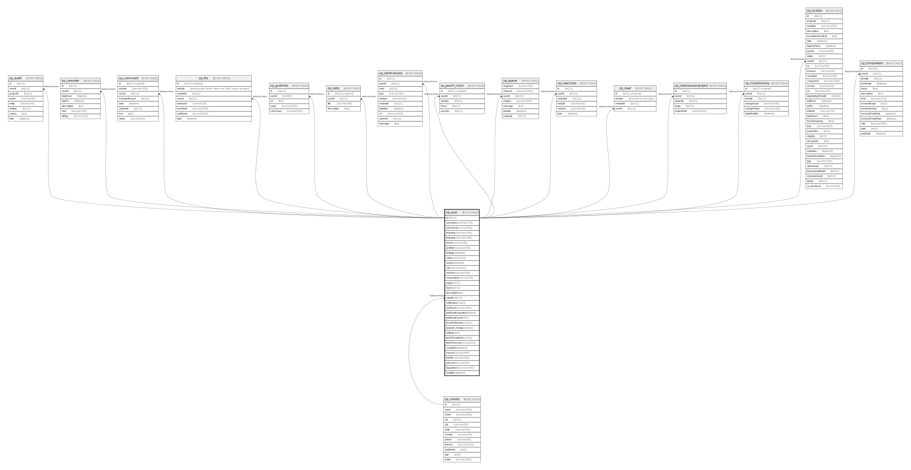

# zp_user

## 概要

<details>
<summary><strong>テーブル定義</strong></summary>

```sql
CREATE TABLE `zp_user` (
  `id` int(11) NOT NULL AUTO_INCREMENT,
  `username` varchar(175) NOT NULL,
  `password` varchar(255) NOT NULL DEFAULT '',
  `firstname` varchar(100) NOT NULL,
  `lastname` varchar(100) NOT NULL,
  `phone` varchar(25) NOT NULL,
  `profileId` varchar(100) NOT NULL DEFAULT '',
  `lastlogin` datetime DEFAULT NULL,
  `status` varchar(1) NOT NULL DEFAULT 'A',
  `expires` datetime DEFAULT NULL,
  `role` varchar(200) NOT NULL,
  `session` varchar(100) DEFAULT NULL,
  `sessiontime` varchar(50) DEFAULT NULL,
  `wage` int(11) DEFAULT NULL,
  `hours` int(11) DEFAULT NULL,
  `description` text DEFAULT NULL,
  `clientId` int(11) DEFAULT NULL,
  `notifications` int(2) DEFAULT NULL,
  `pwReset` varchar(100) DEFAULT NULL,
  `pwResetExpiration` datetime DEFAULT NULL,
  `pwResetCount` int(5) DEFAULT NULL,
  `forcePwReset` tinyint(4) DEFAULT NULL,
  `lastpwd_change` datetime DEFAULT NULL,
  `settings` text DEFAULT NULL,
  `twoFAEnabled` tinyint(1) DEFAULT 0,
  `twoFASecret` varchar(200) DEFAULT NULL,
  `createdOn` datetime DEFAULT NULL,
  `source` varchar(200) DEFAULT NULL,
  `jobTitle` varchar(200) DEFAULT NULL,
  `jobLevel` varchar(50) DEFAULT NULL,
  `department` varchar(200) DEFAULT NULL,
  `modified` datetime DEFAULT NULL,
  PRIMARY KEY (`id`),
  UNIQUE KEY `username` (`username`)
) ENGINE=InnoDB AUTO_INCREMENT=[Redacted by tbls] DEFAULT CHARSET=utf8mb4 COLLATE=utf8mb4_unicode_ci
```

</details>

## カラム一覧

| 名前                | タイプ          | デフォルト値       | Nullable | Extra Definition | 子テーブル                                                                                                                                                                                                                                                                                                                                                                                                                                                                             | 親テーブル                       | コメント     |
| ----------------- | ------------ | ------------ | -------- | ---------------- | --------------------------------------------------------------------------------------------------------------------------------------------------------------------------------------------------------------------------------------------------------------------------------------------------------------------------------------------------------------------------------------------------------------------------------------------------------------------------------- | --------------------------- | -------- |
| id                | int(11)      |              | false    | auto_increment   | [zp_audit](zp_audit.md) [zp_calendar](zp_calendar.md) [zp_comment](zp_comment.md) [zp_file](zp_file.md) [zp_gcallinks](zp_gcallinks.md) [zp_note](zp_note.md) [zp_notifications](zp_notifications.md) [zp_punch_clock](zp_punch_clock.md) [zp_queue](zp_queue.md) [zp_reactions](zp_reactions.md) [zp_read](zp_read.md) [zp_relationuserproject](zp_relationuserproject.md) [zp_tickethistory](zp_tickethistory.md) [zp_tickets](zp_tickets.md) [zp_timesheets](zp_timesheets.md) |                             |          |
| username          | varchar(175) |              | false    |                  |                                                                                                                                                                                                                                                                                                                                                                                                                                                                                   |                             |          |
| password          | varchar(255) | ''           | false    |                  |                                                                                                                                                                                                                                                                                                                                                                                                                                                                                   |                             |          |
| firstname         | varchar(100) |              | false    |                  |                                                                                                                                                                                                                                                                                                                                                                                                                                                                                   |                             |          |
| lastname          | varchar(100) |              | false    |                  |                                                                                                                                                                                                                                                                                                                                                                                                                                                                                   |                             |          |
| phone             | varchar(25)  |              | false    |                  |                                                                                                                                                                                                                                                                                                                                                                                                                                                                                   |                             |          |
| profileId         | varchar(100) | ''           | false    |                  |                                                                                                                                                                                                                                                                                                                                                                                                                                                                                   |                             |          |
| lastlogin         | datetime     | NULL         | true     |                  |                                                                                                                                                                                                                                                                                                                                                                                                                                                                                   |                             |          |
| status            | varchar(1)   | 'A'          | false    |                  |                                                                                                                                                                                                                                                                                                                                                                                                                                                                                   |                             |          |
| expires           | datetime     | NULL         | true     |                  |                                                                                                                                                                                                                                                                                                                                                                                                                                                                                   |                             |          |
| role              | varchar(200) |              | false    |                  |                                                                                                                                                                                                                                                                                                                                                                                                                                                                                   |                             |          |
| session           | varchar(100) | NULL         | true     |                  |                                                                                                                                                                                                                                                                                                                                                                                                                                                                                   |                             |          |
| sessiontime       | varchar(50)  | NULL         | true     |                  |                                                                                                                                                                                                                                                                                                                                                                                                                                                                                   |                             |          |
| wage              | int(11)      | NULL         | true     |                  |                                                                                                                                                                                                                                                                                                                                                                                                                                                                                   |                             |          |
| hours             | int(11)      | NULL         | true     |                  |                                                                                                                                                                                                                                                                                                                                                                                                                                                                                   |                             |          |
| description       | text         | NULL         | true     |                  |                                                                                                                                                                                                                                                                                                                                                                                                                                                                                   |                             |          |
| clientId          | int(11)      | NULL         | true     |                  |                                                                                                                                                                                                                                                                                                                                                                                                                                                                                   | [zp_clients](zp_clients.md) |          |
| notifications     | int(2)       | NULL         | true     |                  |                                                                                                                                                                                                                                                                                                                                                                                                                                                                                   |                             |          |
| pwReset           | varchar(100) | NULL         | true     |                  |                                                                                                                                                                                                                                                                                                                                                                                                                                                                                   |                             |          |
| pwResetExpiration | datetime     | NULL         | true     |                  |                                                                                                                                                                                                                                                                                                                                                                                                                                                                                   |                             |          |
| pwResetCount      | int(5)       | NULL         | true     |                  |                                                                                                                                                                                                                                                                                                                                                                                                                                                                                   |                             |          |
| forcePwReset      | tinyint(4)   | NULL         | true     |                  |                                                                                                                                                                                                                                                                                                                                                                                                                                                                                   |                             |          |
| lastpwd_change    | datetime     | NULL         | true     |                  |                                                                                                                                                                                                                                                                                                                                                                                                                                                                                   |                             |          |
| settings          | text         | NULL         | true     |                  |                                                                                                                                                                                                                                                                                                                                                                                                                                                                                   |                             |          |
| twoFAEnabled      | tinyint(1)   | 0            | true     |                  |                                                                                                                                                                                                                                                                                                                                                                                                                                                                                   |                             |          |
| twoFASecret       | varchar(200) | NULL         | true     |                  |                                                                                                                                                                                                                                                                                                                                                                                                                                                                                   |                             |          |
| createdOn         | datetime     | NULL         | true     |                  |                                                                                                                                                                                                                                                                                                                                                                                                                                                                                   |                             |          |
| source            | varchar(200) | NULL         | true     |                  |                                                                                                                                                                                                                                                                                                                                                                                                                                                                                   |                             |          |
| jobTitle          | varchar(200) | NULL         | true     |                  |                                                                                                                                                                                                                                                                                                                                                                                                                                                                                   |                             |          |
| jobLevel          | varchar(50)  | NULL         | true     |                  |                                                                                                                                                                                                                                                                                                                                                                                                                                                                                   |                             |          |
| department        | varchar(200) | NULL         | true     |                  |                                                                                                                                                                                                                                                                                                                                                                                                                                                                                   |                             |          |
| modified          | datetime     | NULL         | true     |                  |                                                                                                                                                                                                                                                                                                                                                                                                                                                                                   |                             |          |

## 制約一覧

| 名前       | タイプ         | 定義                             |
| -------- | ----------- | ------------------------------ |
| PRIMARY  | PRIMARY KEY | PRIMARY KEY (id)               |
| username | UNIQUE      | UNIQUE KEY username (username) |

## INDEX一覧

| 名前       | 定義                                         |
| -------- | ------------------------------------------ |
| PRIMARY  | PRIMARY KEY (id) USING BTREE               |
| username | UNIQUE KEY username (username) USING BTREE |

## ER図



---

> Generated by [tbls](https://github.com/k1LoW/tbls)
