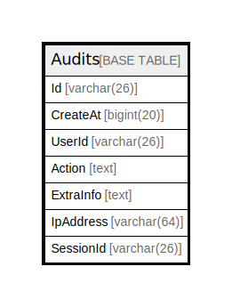

# Audits

## 概要

<details>
<summary><strong>テーブル定義</strong></summary>

```sql
CREATE TABLE `Audits` (
  `Id` varchar(26) NOT NULL,
  `CreateAt` bigint(20) DEFAULT NULL,
  `UserId` varchar(26) DEFAULT NULL,
  `Action` text DEFAULT NULL,
  `ExtraInfo` text DEFAULT NULL,
  `IpAddress` varchar(64) DEFAULT NULL,
  `SessionId` varchar(26) DEFAULT NULL,
  PRIMARY KEY (`Id`),
  KEY `idx_audits_user_id` (`UserId`)
) ENGINE=InnoDB DEFAULT CHARSET=utf8mb4
```

</details>

## カラム一覧

| 名前        | タイプ         | デフォルト値       | NULL許可   | 子テーブル      | 親テーブル      | コメント     |
| --------- | ----------- | ------------ | -------- | ---------- | ---------- | -------- |
| Id        | varchar(26) |              | false    |            |            |          |
| CreateAt  | bigint(20)  | NULL         | true     |            |            |          |
| UserId    | varchar(26) | NULL         | true     |            |            |          |
| Action    | text        | NULL         | true     |            |            |          |
| ExtraInfo | text        | NULL         | true     |            |            |          |
| IpAddress | varchar(64) | NULL         | true     |            |            |          |
| SessionId | varchar(26) | NULL         | true     |            |            |          |

## 制約一覧

| 名前      | タイプ         | 定義               |
| ------- | ----------- | ---------------- |
| PRIMARY | PRIMARY KEY | PRIMARY KEY (Id) |

## INDEX一覧

| 名前                 | 定義                                          |
| ------------------ | ------------------------------------------- |
| idx_audits_user_id | KEY idx_audits_user_id (UserId) USING BTREE |
| PRIMARY            | PRIMARY KEY (Id) USING BTREE                |

## ER図



---

> Generated by [tbls](https://github.com/k1LoW/tbls)
