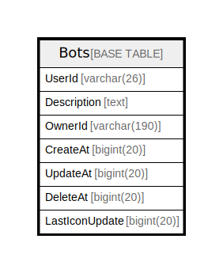

# Bots

## 概要

<details>
<summary><strong>テーブル定義</strong></summary>

```sql
CREATE TABLE `Bots` (
  `UserId` varchar(26) NOT NULL,
  `Description` text DEFAULT NULL,
  `OwnerId` varchar(190) DEFAULT NULL,
  `CreateAt` bigint(20) DEFAULT NULL,
  `UpdateAt` bigint(20) DEFAULT NULL,
  `DeleteAt` bigint(20) DEFAULT NULL,
  `LastIconUpdate` bigint(20) DEFAULT NULL,
  PRIMARY KEY (`UserId`)
) ENGINE=InnoDB DEFAULT CHARSET=utf8mb4
```

</details>

## カラム一覧

| 名前             | タイプ          | デフォルト値       | NULL許可   | 子テーブル      | 親テーブル      | コメント     |
| -------------- | ------------ | ------------ | -------- | ---------- | ---------- | -------- |
| UserId         | varchar(26)  |              | false    |            |            |          |
| Description    | text         | NULL         | true     |            |            |          |
| OwnerId        | varchar(190) | NULL         | true     |            |            |          |
| CreateAt       | bigint(20)   | NULL         | true     |            |            |          |
| UpdateAt       | bigint(20)   | NULL         | true     |            |            |          |
| DeleteAt       | bigint(20)   | NULL         | true     |            |            |          |
| LastIconUpdate | bigint(20)   | NULL         | true     |            |            |          |

## 制約一覧

| 名前      | タイプ         | 定義                   |
| ------- | ----------- | -------------------- |
| PRIMARY | PRIMARY KEY | PRIMARY KEY (UserId) |

## INDEX一覧

| 名前      | 定義                               |
| ------- | -------------------------------- |
| PRIMARY | PRIMARY KEY (UserId) USING BTREE |

## ER図



---

> Generated by [tbls](https://github.com/k1LoW/tbls)
