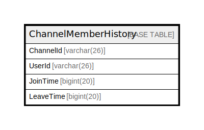

# ChannelMemberHistory

## 概要

<details>
<summary><strong>テーブル定義</strong></summary>

```sql
CREATE TABLE `ChannelMemberHistory` (
  `ChannelId` varchar(26) NOT NULL,
  `UserId` varchar(26) NOT NULL,
  `JoinTime` bigint(20) NOT NULL,
  `LeaveTime` bigint(20) DEFAULT NULL,
  PRIMARY KEY (`ChannelId`,`UserId`,`JoinTime`)
) ENGINE=InnoDB DEFAULT CHARSET=utf8mb4
```

</details>

## カラム一覧

| 名前        | タイプ         | デフォルト値       | NULL許可   | 子テーブル      | 親テーブル      | コメント     |
| --------- | ----------- | ------------ | -------- | ---------- | ---------- | -------- |
| ChannelId | varchar(26) |              | false    |            |            |          |
| UserId    | varchar(26) |              | false    |            |            |          |
| JoinTime  | bigint(20)  |              | false    |            |            |          |
| LeaveTime | bigint(20)  | NULL         | true     |            |            |          |

## 制約一覧

| 名前      | タイプ         | 定義                                        |
| ------- | ----------- | ----------------------------------------- |
| PRIMARY | PRIMARY KEY | PRIMARY KEY (ChannelId, UserId, JoinTime) |

## INDEX一覧

| 名前      | 定義                                                    |
| ------- | ----------------------------------------------------- |
| PRIMARY | PRIMARY KEY (ChannelId, UserId, JoinTime) USING BTREE |

## ER図



---

> Generated by [tbls](https://github.com/k1LoW/tbls)
