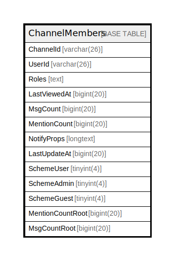

# ChannelMembers

## 概要

<details>
<summary><strong>テーブル定義</strong></summary>

```sql
CREATE TABLE `ChannelMembers` (
  `ChannelId` varchar(26) NOT NULL,
  `UserId` varchar(26) NOT NULL,
  `Roles` text DEFAULT NULL,
  `LastViewedAt` bigint(20) DEFAULT NULL,
  `MsgCount` bigint(20) DEFAULT NULL,
  `MentionCount` bigint(20) DEFAULT NULL,
  `NotifyProps` longtext CHARACTER SET utf8mb4 COLLATE utf8mb4_bin DEFAULT NULL CHECK (json_valid(`NotifyProps`)),
  `LastUpdateAt` bigint(20) DEFAULT NULL,
  `SchemeUser` tinyint(4) DEFAULT NULL,
  `SchemeAdmin` tinyint(4) DEFAULT NULL,
  `SchemeGuest` tinyint(4) DEFAULT NULL,
  `MentionCountRoot` bigint(20) DEFAULT NULL,
  `MsgCountRoot` bigint(20) DEFAULT NULL,
  PRIMARY KEY (`ChannelId`,`UserId`),
  KEY `idx_channelmembers_user_id_channel_id_last_viewed_at` (`UserId`,`ChannelId`,`LastViewedAt`),
  KEY `idx_channelmembers_channel_id_scheme_guest_user_id` (`ChannelId`,`SchemeGuest`,`UserId`)
) ENGINE=InnoDB DEFAULT CHARSET=utf8mb4
```

</details>

## カラム一覧

| 名前               | タイプ         | デフォルト値       | NULL許可   | 子テーブル      | 親テーブル      | コメント     |
| ---------------- | ----------- | ------------ | -------- | ---------- | ---------- | -------- |
| ChannelId        | varchar(26) |              | false    |            |            |          |
| UserId           | varchar(26) |              | false    |            |            |          |
| Roles            | text        | NULL         | true     |            |            |          |
| LastViewedAt     | bigint(20)  | NULL         | true     |            |            |          |
| MsgCount         | bigint(20)  | NULL         | true     |            |            |          |
| MentionCount     | bigint(20)  | NULL         | true     |            |            |          |
| NotifyProps      | longtext    | NULL         | true     |            |            |          |
| LastUpdateAt     | bigint(20)  | NULL         | true     |            |            |          |
| SchemeUser       | tinyint(4)  | NULL         | true     |            |            |          |
| SchemeAdmin      | tinyint(4)  | NULL         | true     |            |            |          |
| SchemeGuest      | tinyint(4)  | NULL         | true     |            |            |          |
| MentionCountRoot | bigint(20)  | NULL         | true     |            |            |          |
| MsgCountRoot     | bigint(20)  | NULL         | true     |            |            |          |

## 制約一覧

| 名前      | タイプ         | 定義                              |
| ------- | ----------- | ------------------------------- |
| PRIMARY | PRIMARY KEY | PRIMARY KEY (ChannelId, UserId) |

## INDEX一覧

| 名前                                                   | 定義                                                                                                     |
| ---------------------------------------------------- | ------------------------------------------------------------------------------------------------------ |
| idx_channelmembers_channel_id_scheme_guest_user_id   | KEY idx_channelmembers_channel_id_scheme_guest_user_id (ChannelId, SchemeGuest, UserId) USING BTREE    |
| idx_channelmembers_user_id_channel_id_last_viewed_at | KEY idx_channelmembers_user_id_channel_id_last_viewed_at (UserId, ChannelId, LastViewedAt) USING BTREE |
| PRIMARY                                              | PRIMARY KEY (ChannelId, UserId) USING BTREE                                                            |

## ER図



---

> Generated by [tbls](https://github.com/k1LoW/tbls)
