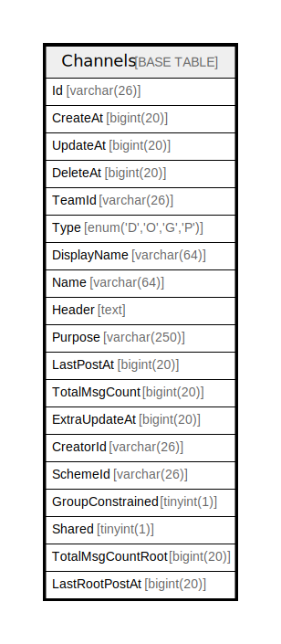

# Channels

## 概要

<details>
<summary><strong>テーブル定義</strong></summary>

```sql
CREATE TABLE `Channels` (
  `Id` varchar(26) NOT NULL,
  `CreateAt` bigint(20) DEFAULT NULL,
  `UpdateAt` bigint(20) DEFAULT NULL,
  `DeleteAt` bigint(20) DEFAULT NULL,
  `TeamId` varchar(26) DEFAULT NULL,
  `Type` enum('D','O','G','P') DEFAULT NULL,
  `DisplayName` varchar(64) DEFAULT NULL,
  `Name` varchar(64) DEFAULT NULL,
  `Header` text DEFAULT NULL,
  `Purpose` varchar(250) DEFAULT NULL,
  `LastPostAt` bigint(20) DEFAULT NULL,
  `TotalMsgCount` bigint(20) DEFAULT NULL,
  `ExtraUpdateAt` bigint(20) DEFAULT NULL,
  `CreatorId` varchar(26) DEFAULT NULL,
  `SchemeId` varchar(26) DEFAULT NULL,
  `GroupConstrained` tinyint(1) DEFAULT NULL,
  `Shared` tinyint(1) DEFAULT NULL,
  `TotalMsgCountRoot` bigint(20) DEFAULT NULL,
  `LastRootPostAt` bigint(20) DEFAULT 0,
  PRIMARY KEY (`Id`),
  UNIQUE KEY `Name` (`Name`,`TeamId`),
  KEY `idx_channels_update_at` (`UpdateAt`),
  KEY `idx_channels_create_at` (`CreateAt`),
  KEY `idx_channels_delete_at` (`DeleteAt`),
  KEY `idx_channels_scheme_id` (`SchemeId`),
  KEY `idx_channels_team_id_display_name` (`TeamId`,`DisplayName`),
  KEY `idx_channels_team_id_type` (`TeamId`,`Type`),
  FULLTEXT KEY `idx_channel_search_txt` (`Name`,`DisplayName`,`Purpose`)
) ENGINE=InnoDB DEFAULT CHARSET=utf8mb4
```

</details>

## カラム一覧

| 名前                | タイプ                   | デフォルト値       | NULL許可   | 子テーブル      | 親テーブル      | コメント     |
| ----------------- | --------------------- | ------------ | -------- | ---------- | ---------- | -------- |
| Id                | varchar(26)           |              | false    |            |            |          |
| CreateAt          | bigint(20)            | NULL         | true     |            |            |          |
| UpdateAt          | bigint(20)            | NULL         | true     |            |            |          |
| DeleteAt          | bigint(20)            | NULL         | true     |            |            |          |
| TeamId            | varchar(26)           | NULL         | true     |            |            |          |
| Type              | enum('D','O','G','P') | NULL         | true     |            |            |          |
| DisplayName       | varchar(64)           | NULL         | true     |            |            |          |
| Name              | varchar(64)           | NULL         | true     |            |            |          |
| Header            | text                  | NULL         | true     |            |            |          |
| Purpose           | varchar(250)          | NULL         | true     |            |            |          |
| LastPostAt        | bigint(20)            | NULL         | true     |            |            |          |
| TotalMsgCount     | bigint(20)            | NULL         | true     |            |            |          |
| ExtraUpdateAt     | bigint(20)            | NULL         | true     |            |            |          |
| CreatorId         | varchar(26)           | NULL         | true     |            |            |          |
| SchemeId          | varchar(26)           | NULL         | true     |            |            |          |
| GroupConstrained  | tinyint(1)            | NULL         | true     |            |            |          |
| Shared            | tinyint(1)            | NULL         | true     |            |            |          |
| TotalMsgCountRoot | bigint(20)            | NULL         | true     |            |            |          |
| LastRootPostAt    | bigint(20)            | 0            | true     |            |            |          |

## 制約一覧

| 名前      | タイプ         | 定義                             |
| ------- | ----------- | ------------------------------ |
| Name    | UNIQUE      | UNIQUE KEY Name (Name, TeamId) |
| PRIMARY | PRIMARY KEY | PRIMARY KEY (Id)               |

## INDEX一覧

| 名前                                | 定義                                                                      |
| --------------------------------- | ----------------------------------------------------------------------- |
| idx_channels_create_at            | KEY idx_channels_create_at (CreateAt) USING BTREE                       |
| idx_channels_delete_at            | KEY idx_channels_delete_at (DeleteAt) USING BTREE                       |
| idx_channels_scheme_id            | KEY idx_channels_scheme_id (SchemeId) USING BTREE                       |
| idx_channels_team_id_display_name | KEY idx_channels_team_id_display_name (TeamId, DisplayName) USING BTREE |
| idx_channels_team_id_type         | KEY idx_channels_team_id_type (TeamId, Type) USING BTREE                |
| idx_channels_update_at            | KEY idx_channels_update_at (UpdateAt) USING BTREE                       |
| idx_channel_search_txt            | KEY idx_channel_search_txt (Name, DisplayName, Purpose) USING FULLTEXT  |
| PRIMARY                           | PRIMARY KEY (Id) USING BTREE                                            |
| Name                              | UNIQUE KEY Name (Name, TeamId) USING BTREE                              |

## ER図



---

> Generated by [tbls](https://github.com/k1LoW/tbls)
