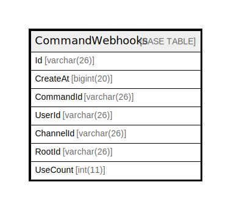

# CommandWebhooks

## 概要

<details>
<summary><strong>テーブル定義</strong></summary>

```sql
CREATE TABLE `CommandWebhooks` (
  `Id` varchar(26) NOT NULL,
  `CreateAt` bigint(20) DEFAULT NULL,
  `CommandId` varchar(26) DEFAULT NULL,
  `UserId` varchar(26) DEFAULT NULL,
  `ChannelId` varchar(26) DEFAULT NULL,
  `RootId` varchar(26) DEFAULT NULL,
  `UseCount` int(11) DEFAULT NULL,
  PRIMARY KEY (`Id`),
  KEY `idx_command_webhook_create_at` (`CreateAt`)
) ENGINE=InnoDB DEFAULT CHARSET=utf8mb4
```

</details>

## カラム一覧

| 名前        | タイプ         | デフォルト値       | NULL許可   | 子テーブル      | 親テーブル      | コメント     |
| --------- | ----------- | ------------ | -------- | ---------- | ---------- | -------- |
| Id        | varchar(26) |              | false    |            |            |          |
| CreateAt  | bigint(20)  | NULL         | true     |            |            |          |
| CommandId | varchar(26) | NULL         | true     |            |            |          |
| UserId    | varchar(26) | NULL         | true     |            |            |          |
| ChannelId | varchar(26) | NULL         | true     |            |            |          |
| RootId    | varchar(26) | NULL         | true     |            |            |          |
| UseCount  | int(11)     | NULL         | true     |            |            |          |

## 制約一覧

| 名前      | タイプ         | 定義               |
| ------- | ----------- | ---------------- |
| PRIMARY | PRIMARY KEY | PRIMARY KEY (Id) |

## INDEX一覧

| 名前                            | 定義                                                       |
| ----------------------------- | -------------------------------------------------------- |
| idx_command_webhook_create_at | KEY idx_command_webhook_create_at (CreateAt) USING BTREE |
| PRIMARY                       | PRIMARY KEY (Id) USING BTREE                             |

## ER図



---

> Generated by [tbls](https://github.com/k1LoW/tbls)
