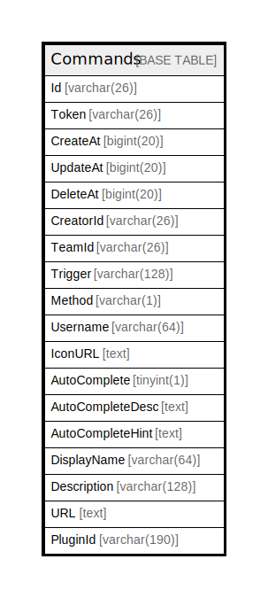

# Commands

## 概要

<details>
<summary><strong>テーブル定義</strong></summary>

```sql
CREATE TABLE `Commands` (
  `Id` varchar(26) NOT NULL,
  `Token` varchar(26) DEFAULT NULL,
  `CreateAt` bigint(20) DEFAULT NULL,
  `UpdateAt` bigint(20) DEFAULT NULL,
  `DeleteAt` bigint(20) DEFAULT NULL,
  `CreatorId` varchar(26) DEFAULT NULL,
  `TeamId` varchar(26) DEFAULT NULL,
  `Trigger` varchar(128) DEFAULT NULL,
  `Method` varchar(1) DEFAULT NULL,
  `Username` varchar(64) DEFAULT NULL,
  `IconURL` text DEFAULT NULL,
  `AutoComplete` tinyint(1) DEFAULT NULL,
  `AutoCompleteDesc` text DEFAULT NULL,
  `AutoCompleteHint` text DEFAULT NULL,
  `DisplayName` varchar(64) DEFAULT NULL,
  `Description` varchar(128) DEFAULT NULL,
  `URL` text DEFAULT NULL,
  `PluginId` varchar(190) DEFAULT NULL,
  PRIMARY KEY (`Id`),
  KEY `idx_command_team_id` (`TeamId`),
  KEY `idx_command_update_at` (`UpdateAt`),
  KEY `idx_command_create_at` (`CreateAt`),
  KEY `idx_command_delete_at` (`DeleteAt`)
) ENGINE=InnoDB DEFAULT CHARSET=utf8mb4
```

</details>

## カラム一覧

| 名前               | タイプ          | デフォルト値       | NULL許可   | 子テーブル      | 親テーブル      | コメント     |
| ---------------- | ------------ | ------------ | -------- | ---------- | ---------- | -------- |
| Id               | varchar(26)  |              | false    |            |            |          |
| Token            | varchar(26)  | NULL         | true     |            |            |          |
| CreateAt         | bigint(20)   | NULL         | true     |            |            |          |
| UpdateAt         | bigint(20)   | NULL         | true     |            |            |          |
| DeleteAt         | bigint(20)   | NULL         | true     |            |            |          |
| CreatorId        | varchar(26)  | NULL         | true     |            |            |          |
| TeamId           | varchar(26)  | NULL         | true     |            |            |          |
| Trigger          | varchar(128) | NULL         | true     |            |            |          |
| Method           | varchar(1)   | NULL         | true     |            |            |          |
| Username         | varchar(64)  | NULL         | true     |            |            |          |
| IconURL          | text         | NULL         | true     |            |            |          |
| AutoComplete     | tinyint(1)   | NULL         | true     |            |            |          |
| AutoCompleteDesc | text         | NULL         | true     |            |            |          |
| AutoCompleteHint | text         | NULL         | true     |            |            |          |
| DisplayName      | varchar(64)  | NULL         | true     |            |            |          |
| Description      | varchar(128) | NULL         | true     |            |            |          |
| URL              | text         | NULL         | true     |            |            |          |
| PluginId         | varchar(190) | NULL         | true     |            |            |          |

## 制約一覧

| 名前      | タイプ         | 定義               |
| ------- | ----------- | ---------------- |
| PRIMARY | PRIMARY KEY | PRIMARY KEY (Id) |

## INDEX一覧

| 名前                    | 定義                                               |
| --------------------- | ------------------------------------------------ |
| idx_command_create_at | KEY idx_command_create_at (CreateAt) USING BTREE |
| idx_command_delete_at | KEY idx_command_delete_at (DeleteAt) USING BTREE |
| idx_command_team_id   | KEY idx_command_team_id (TeamId) USING BTREE     |
| idx_command_update_at | KEY idx_command_update_at (UpdateAt) USING BTREE |
| PRIMARY               | PRIMARY KEY (Id) USING BTREE                     |

## ER図



---

> Generated by [tbls](https://github.com/k1LoW/tbls)
