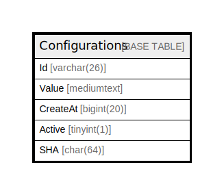

# Configurations

## 概要

<details>
<summary><strong>テーブル定義</strong></summary>

```sql
CREATE TABLE `Configurations` (
  `Id` varchar(26) NOT NULL,
  `Value` mediumtext DEFAULT NULL,
  `CreateAt` bigint(20) NOT NULL,
  `Active` tinyint(1) DEFAULT NULL,
  `SHA` char(64) DEFAULT '',
  PRIMARY KEY (`Id`),
  UNIQUE KEY `Active` (`Active`)
) ENGINE=InnoDB DEFAULT CHARSET=utf8mb4
```

</details>

## カラム一覧

| 名前       | タイプ         | デフォルト値       | NULL許可   | 子テーブル      | 親テーブル      | コメント     |
| -------- | ----------- | ------------ | -------- | ---------- | ---------- | -------- |
| Id       | varchar(26) |              | false    |            |            |          |
| Value    | mediumtext  | NULL         | true     |            |            |          |
| CreateAt | bigint(20)  |              | false    |            |            |          |
| Active   | tinyint(1)  | NULL         | true     |            |            |          |
| SHA      | char(64)    | ''           | true     |            |            |          |

## 制約一覧

| 名前      | タイプ         | 定義                         |
| ------- | ----------- | -------------------------- |
| Active  | UNIQUE      | UNIQUE KEY Active (Active) |
| PRIMARY | PRIMARY KEY | PRIMARY KEY (Id)           |

## INDEX一覧

| 名前      | 定義                                     |
| ------- | -------------------------------------- |
| PRIMARY | PRIMARY KEY (Id) USING BTREE           |
| Active  | UNIQUE KEY Active (Active) USING BTREE |

## ER図



---

> Generated by [tbls](https://github.com/k1LoW/tbls)
