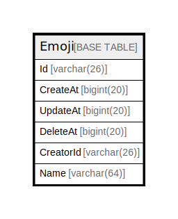

# Emoji

## 概要

<details>
<summary><strong>テーブル定義</strong></summary>

```sql
CREATE TABLE `Emoji` (
  `Id` varchar(26) NOT NULL,
  `CreateAt` bigint(20) DEFAULT NULL,
  `UpdateAt` bigint(20) DEFAULT NULL,
  `DeleteAt` bigint(20) DEFAULT NULL,
  `CreatorId` varchar(26) DEFAULT NULL,
  `Name` varchar(64) DEFAULT NULL,
  PRIMARY KEY (`Id`),
  UNIQUE KEY `Name` (`Name`,`DeleteAt`),
  KEY `idx_emoji_update_at` (`UpdateAt`),
  KEY `idx_emoji_create_at` (`CreateAt`),
  KEY `idx_emoji_delete_at` (`DeleteAt`)
) ENGINE=InnoDB DEFAULT CHARSET=utf8mb4
```

</details>

## カラム一覧

| 名前        | タイプ         | デフォルト値       | NULL許可   | 子テーブル      | 親テーブル      | コメント     |
| --------- | ----------- | ------------ | -------- | ---------- | ---------- | -------- |
| Id        | varchar(26) |              | false    |            |            |          |
| CreateAt  | bigint(20)  | NULL         | true     |            |            |          |
| UpdateAt  | bigint(20)  | NULL         | true     |            |            |          |
| DeleteAt  | bigint(20)  | NULL         | true     |            |            |          |
| CreatorId | varchar(26) | NULL         | true     |            |            |          |
| Name      | varchar(64) | NULL         | true     |            |            |          |

## 制約一覧

| 名前      | タイプ         | 定義                               |
| ------- | ----------- | -------------------------------- |
| Name    | UNIQUE      | UNIQUE KEY Name (Name, DeleteAt) |
| PRIMARY | PRIMARY KEY | PRIMARY KEY (Id)                 |

## INDEX一覧

| 名前                  | 定義                                             |
| ------------------- | ---------------------------------------------- |
| idx_emoji_create_at | KEY idx_emoji_create_at (CreateAt) USING BTREE |
| idx_emoji_delete_at | KEY idx_emoji_delete_at (DeleteAt) USING BTREE |
| idx_emoji_update_at | KEY idx_emoji_update_at (UpdateAt) USING BTREE |
| PRIMARY             | PRIMARY KEY (Id) USING BTREE                   |
| Name                | UNIQUE KEY Name (Name, DeleteAt) USING BTREE   |

## ER図



---

> Generated by [tbls](https://github.com/k1LoW/tbls)
