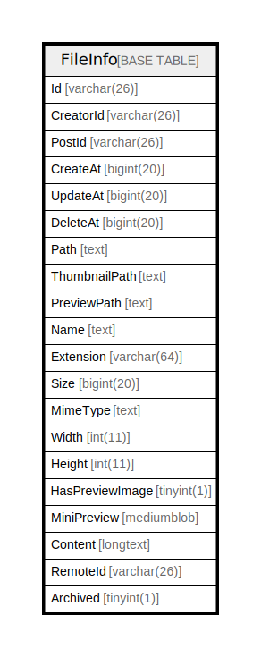

# FileInfo

## 概要

<details>
<summary><strong>テーブル定義</strong></summary>

```sql
CREATE TABLE `FileInfo` (
  `Id` varchar(26) NOT NULL,
  `CreatorId` varchar(26) DEFAULT NULL,
  `PostId` varchar(26) DEFAULT NULL,
  `CreateAt` bigint(20) DEFAULT NULL,
  `UpdateAt` bigint(20) DEFAULT NULL,
  `DeleteAt` bigint(20) DEFAULT NULL,
  `Path` text DEFAULT NULL,
  `ThumbnailPath` text DEFAULT NULL,
  `PreviewPath` text DEFAULT NULL,
  `Name` text DEFAULT NULL,
  `Extension` varchar(64) DEFAULT NULL,
  `Size` bigint(20) DEFAULT NULL,
  `MimeType` text DEFAULT NULL,
  `Width` int(11) DEFAULT NULL,
  `Height` int(11) DEFAULT NULL,
  `HasPreviewImage` tinyint(1) DEFAULT NULL,
  `MiniPreview` mediumblob DEFAULT NULL,
  `Content` longtext DEFAULT NULL,
  `RemoteId` varchar(26) DEFAULT NULL,
  `Archived` tinyint(1) NOT NULL DEFAULT 0,
  PRIMARY KEY (`Id`),
  KEY `idx_fileinfo_update_at` (`UpdateAt`),
  KEY `idx_fileinfo_create_at` (`CreateAt`),
  KEY `idx_fileinfo_delete_at` (`DeleteAt`),
  KEY `idx_fileinfo_postid_at` (`PostId`),
  KEY `idx_fileinfo_extension_at` (`Extension`),
  FULLTEXT KEY `idx_fileinfo_name_txt` (`Name`),
  FULLTEXT KEY `idx_fileinfo_content_txt` (`Content`)
) ENGINE=InnoDB DEFAULT CHARSET=utf8mb4
```

</details>

## カラム一覧

| 名前              | タイプ         | デフォルト値       | NULL許可   | 子テーブル      | 親テーブル      | コメント     |
| --------------- | ----------- | ------------ | -------- | ---------- | ---------- | -------- |
| Id              | varchar(26) |              | false    |            |            |          |
| CreatorId       | varchar(26) | NULL         | true     |            |            |          |
| PostId          | varchar(26) | NULL         | true     |            |            |          |
| CreateAt        | bigint(20)  | NULL         | true     |            |            |          |
| UpdateAt        | bigint(20)  | NULL         | true     |            |            |          |
| DeleteAt        | bigint(20)  | NULL         | true     |            |            |          |
| Path            | text        | NULL         | true     |            |            |          |
| ThumbnailPath   | text        | NULL         | true     |            |            |          |
| PreviewPath     | text        | NULL         | true     |            |            |          |
| Name            | text        | NULL         | true     |            |            |          |
| Extension       | varchar(64) | NULL         | true     |            |            |          |
| Size            | bigint(20)  | NULL         | true     |            |            |          |
| MimeType        | text        | NULL         | true     |            |            |          |
| Width           | int(11)     | NULL         | true     |            |            |          |
| Height          | int(11)     | NULL         | true     |            |            |          |
| HasPreviewImage | tinyint(1)  | NULL         | true     |            |            |          |
| MiniPreview     | mediumblob  | NULL         | true     |            |            |          |
| Content         | longtext    | NULL         | true     |            |            |          |
| RemoteId        | varchar(26) | NULL         | true     |            |            |          |
| Archived        | tinyint(1)  | 0            | false    |            |            |          |

## 制約一覧

| 名前      | タイプ         | 定義               |
| ------- | ----------- | ---------------- |
| PRIMARY | PRIMARY KEY | PRIMARY KEY (Id) |

## INDEX一覧

| 名前                        | 定義                                                    |
| ------------------------- | ----------------------------------------------------- |
| idx_fileinfo_content_txt  | KEY idx_fileinfo_content_txt (Content) USING FULLTEXT |
| idx_fileinfo_create_at    | KEY idx_fileinfo_create_at (CreateAt) USING BTREE     |
| idx_fileinfo_delete_at    | KEY idx_fileinfo_delete_at (DeleteAt) USING BTREE     |
| idx_fileinfo_extension_at | KEY idx_fileinfo_extension_at (Extension) USING BTREE |
| idx_fileinfo_name_txt     | KEY idx_fileinfo_name_txt (Name) USING FULLTEXT       |
| idx_fileinfo_postid_at    | KEY idx_fileinfo_postid_at (PostId) USING BTREE       |
| idx_fileinfo_update_at    | KEY idx_fileinfo_update_at (UpdateAt) USING BTREE     |
| PRIMARY                   | PRIMARY KEY (Id) USING BTREE                          |

## ER図



---

> Generated by [tbls](https://github.com/k1LoW/tbls)
