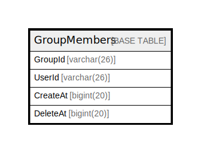

# GroupMembers

## 概要

<details>
<summary><strong>テーブル定義</strong></summary>

```sql
CREATE TABLE `GroupMembers` (
  `GroupId` varchar(26) NOT NULL,
  `UserId` varchar(26) NOT NULL,
  `CreateAt` bigint(20) DEFAULT NULL,
  `DeleteAt` bigint(20) DEFAULT NULL,
  PRIMARY KEY (`GroupId`,`UserId`),
  KEY `idx_groupmembers_create_at` (`CreateAt`)
) ENGINE=InnoDB DEFAULT CHARSET=utf8mb4
```

</details>

## カラム一覧

| 名前       | タイプ         | デフォルト値       | NULL許可   | 子テーブル      | 親テーブル      | コメント     |
| -------- | ----------- | ------------ | -------- | ---------- | ---------- | -------- |
| GroupId  | varchar(26) |              | false    |            |            |          |
| UserId   | varchar(26) |              | false    |            |            |          |
| CreateAt | bigint(20)  | NULL         | true     |            |            |          |
| DeleteAt | bigint(20)  | NULL         | true     |            |            |          |

## 制約一覧

| 名前      | タイプ         | 定義                            |
| ------- | ----------- | ----------------------------- |
| PRIMARY | PRIMARY KEY | PRIMARY KEY (GroupId, UserId) |

## INDEX一覧

| 名前                         | 定義                                                    |
| -------------------------- | ----------------------------------------------------- |
| idx_groupmembers_create_at | KEY idx_groupmembers_create_at (CreateAt) USING BTREE |
| PRIMARY                    | PRIMARY KEY (GroupId, UserId) USING BTREE             |

## ER図



---

> Generated by [tbls](https://github.com/k1LoW/tbls)
